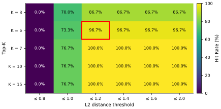
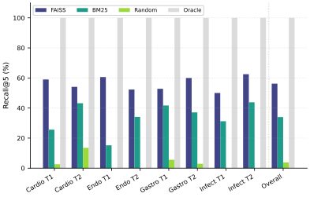
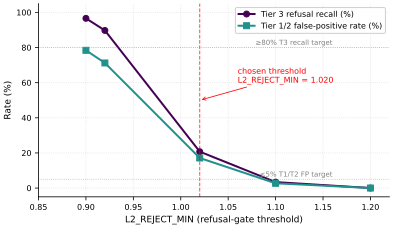

<!--
Public artifact draft: HSE DSBA Medical RAG coursework.
Hard-strip policy:
  - no Stage labels (Stage N / Stage-N)
  - no internal paths (reports/, tests/, multi-agent_system/, scripts/, data/)
  - no citations of internal documents
  - all evidence must appear in this file (tables, figures, appendices)
-->


## Abstract

Clinical decision support requires retrieval grounded in vetted evidence, since general-purpose language models fabricate dosages, diagnostic criteria, and clinical statistics when their parametric memory is queried directly [@singhal2023medpalm]. This prototype implements a multi-agent medical RAG system covering four specialties — cardiology, endocrinology, gastroenterology, and infectious diseases — with three architectural components: an LLM router that classifies the clinical domain of each query, per-specialty FAISS dense and BM25 sparse retrieval over a 2,561-document corpus, and a multi-judge faithfulness evaluator combining two same-family judges with one cross-vendor judge.

Evaluation used a 200-case golden dataset stratified into core, peripheral, and out-of-scope tiers, with a 60-case development split for hyperparameter tuning and a 140-case held-out test split for the reported numbers. On the test split the LLM router reached 95.7% accuracy across the four specialties; FAISS dense retrieval reached Recall@5 (the fraction of gold-source documents retrieved in the top-5 window) of 56.2% averaged over per-specialty gold-document Bernoulli trials; minimum-judge faithfulness (a case counts FAITHFUL only when every configured judge agrees) reached 96.2% under the three-judge cross-vendor panel and 99.2% under the two same-family judges, with the −3.0 pp gap tracking the same-family inflation signal Zheng et al. [-@zheng2023mtbench] predict; and the numeric out-of-scope refusal gate caught 20.7% of Tier 3 queries at a 17.1% Tier 1/2 false-positive rate.

The refusal gate is the principal limitation: both target ratios (≥80% Tier 3 recall, ≤5% Tier 1/2 FP) are unmet because the in-corpus and out-of-corpus L2 distributions overlap heavily at four-specialty scale. The 56.2% retrieval headline also sits below the dense-only ceiling reported by recent medical RAG benchmarks [@xiong2024medrag]; a two-stage gate and a hybrid retriever are the immediate follow-ups.

### Keywords

medical RAG; retrieval-augmented generation; multi-agent system; LLM-as-judge; faithfulness evaluation; refusal gate; FAISS; BM25

## 1. Introduction

Clinical decision support systems require accurate, domain-specific evidence to function safely. While general-purpose Large Language Models (LLMs) can process complex medical queries, their parametric memory is prone to fabricating critical medical facts such as dosages, diagnostic criteria, and clinical statistics — a failure mode quantified for clinical QA by Singhal et al. [-@singhal2023medpalm] and for medical RAG specifically by Xiong et al. [-@xiong2024medrag]. A multi-agent Retrieval-Augmented Generation (RAG) architecture offers a candidate solution by forcing the LLM to ground its reasoning exclusively in verified medical literature retrieved from specialist-specific vector indices. This report evaluates such a prototype, designed for academic investigation rather than immediate clinical use.

This work contributes the following:

1. A four-specialty multi-agent medical RAG architecture evaluated end-to-end on a 200-case tiered golden dataset, with per-specialty FAISS+BM25 retrieval and an LLM router that achieves 95.7% test-split routing accuracy.

2. A multi-judge cross-vendor faithfulness protocol that bounds same-family-LLM-judge bias to a measured −3.0 pp constraint, with upper-bound (99.2%) and lower-bound (96.2%) faithfulness rates reported on the held-out test split.

3. A characterisation of the architectural insufficiency of single-threshold L2 gating for out-of-scope refusal at four-specialty scale — the paper's principal finding. The threshold sweep shows no scalar `L2_REJECT_MIN` value simultaneously meets both target rates (≥80% Tier 3 catch, ≤5% Tier 1/2 false positive); the chosen threshold delivers 20.7% catch with a measured 17.1% false-positive rate, motivating a two-stage L2-plus-classifier gate as the next architectural step.

(1) Does an LLM-based query router add measurable clinical value over a deterministic keyword-matching baseline? (2) How does vector retrieval quality degrade when moving from core textbook conditions to peripheral or out-of-scope clinical scenarios? (3) Can an LLM acting as a strict faithfulness judge reliably detect medical hallucinations in generated responses?

All headline numbers below are from the held-out test split (n = 140). The principal unresolved limitation is the numeric out-of-scope refusal gate: at the re-tuned threshold `L2_REJECT_MIN = 1.020` it catches only **20.7% (6/29) of Tier 3 cases at a 17.1% Tier 1/2 false-positive rate**, leaving the original ≥80% recall / ≤5% FP targets unmet, and a two-stage gate (numeric pre-filter + LLM confirmer) is the proposed remediation (§5.5, §7 L7).

Against that backdrop, the LLM router achieves **95.7% accuracy (134/140) [Wilson 95% CI 91.0%–98.0%]** across four specialties (cardiology, endocrinology, gastroenterology, infectiology); the 6 misses are all defensible cross-specialty cases (§5.1). FAISS dense retrieval reaches **Recall@5 of 56.2% (162/288 gold-doc trials) [50.5%–61.9%]** — 22.2 pp above the BM25 sparse baseline (34.0%) and 43.8 pp short of an oracle ceiling (§5.3, §5.3.2). Minimum-judge faithfulness is bounded above by the 2-Yandex-judge rate of **99.2% (131/132) [95.8%–99.9%]** (single disagreement: `cardio_40`, Tier 2 cardiology — congenital long QT syndrome; unchanged from the prior 2-specialty baseline) and bounded below by the 3-judge cross-vendor rate of **96.2% (127/132) [91.4%–98.4%]**, where the OpenAI GPT-OSS-120B tertiary judge added 4 HALLUCINATION verdicts on cases both Yandex judges marked FAITHFUL — the empirical −3.0 pp same-family-bias signal Zheng et al. [-@zheng2023mtbench] predict (§5.4).

The principal direction beyond this prototype is the two-stage refusal gate described in §7 L7: pairing the L2 distance signal with a generation-step claim-coverage check is the most concrete route to closing the gap between the 20.7% Tier 3 catch and a target rate that would justify clinical use.

### Objectives

1. Route clinical queries to the correct specialist agent with high accuracy.
2. Retrieve contextually relevant evidence from a large medical corpus.
3. Generate responses that are faithful to the retrieved evidence, with no medical hallucinations (fabricated drug names, dosages, diagnostic criteria, or statistics).

---

## 2. Related Work

Four research strands directly shape this prototype's design: medical RAG benchmarks, retrieval-method baselines, LLM-as-judge evaluation methodology, and multi-agent clinical-AI architectures.


### 2.1 Medical RAG benchmarks

Early medical QA benchmarks measured factual recall on closed-form questions; recent work measures retrieval quality and generation faithfulness jointly on specialist corpora. Singhal et al.'s Med-PaLM [@singhal2023medpalm] introduced MultiMedQA, a composite of six clinical and consumer-health QA datasets (MedQA, PubMedQA, MedMCQA, LiveQA, MedicationQA, HealthSearchQA), and showed that domain-instruction-tuned LLMs can match human expert preference on a substantial fraction of consumer questions while still fabricating dangerous specifics in others. Xiong et al.'s MedRAG/MIRAGE benchmark [@xiong2024medrag] extends this to RAG specifically: 7,663 multiple-choice questions across five biomedical corpora, with explicit retrieval/recall/precision per question and an analysis of how chunk granularity and retriever choice affect downstream accuracy. BioASQ [@tsatsaronis2015bioasq] predates both and provides the largest continuously-curated biomedical semantic-indexing + QA shared task, with expert-annotated relevance judgements and ideal/exact-answer pairs over 10+ years of editions.

Unlike MIRAGE and BioASQ, this evaluation uses open-ended clinical scenarios rather than multiple-choice items, stratifies cases by difficulty tier, and explicitly tests refusal on out-of-scope queries. The trade-off is reduced comparability with prior medical-RAG numbers; the comparable surface is the retrieval-quality methodology (top-K, Hit Rate, Recall@K with gold-source labels) and the LLM-as-judge faithfulness protocol described below.

### 2.2 Retrieval method baselines

The canonical RAG framework was introduced by Lewis et al. [-@lewis2020rag]: a dense retriever feeds top-K passages to a generator, both jointly fine-tuned end-to-end. Dense Passage Retrieval [@karpukhin2020dpr] is the dominant dense baseline — a dual-encoder learned via in-batch contrastive loss on Natural Questions / TriviaQA — and the canonical sparse baseline is BM25 [@robertson2009bm25], a probabilistic IDF-weighted lexical match.

This project uses **dense-only Yandex `text-search-doc`/`text-search-query` asymmetric embeddings**, with neither a BM25 sparse baseline nor a hybrid fusion (§5.3.2 evaluates BM25 as a comparison ablation rather than a production component). The decision was a deliberate scope reduction in an earlier dense-only configuration: chunk-size tuning pushed the dev-set Hit Rate to 96.7%; keyword stripping contributed no additional improvement (see §4.5). With this evaluation's grounded Recall@K (58.0% full-set Recall@K vs the legacy 87.5% KeywordHitRate, §5.3 / §5.7) it is now clear that the dense-only choice does miss a substantial fraction of relevant documents. As §5.3.2 confirms, BM25 recovers rare entity names that FAISS misses; hybrid score fusion is the natural next architecture, though it is not evaluated here. The `metadata['keywords']` field on every chunk is preserved precisely for that BM25 future use.

### 2.3 LLM-as-judge methodology

RAGAS [@es2023ragas] formalised automated RAG evaluation with three LLM-judged metrics — faithfulness, answer relevance, and context precision — by asking a strong LLM to score each generated answer against the retrieved context. Zheng et al.'s MT-Bench / Chatbot Arena work [@zheng2023mtbench] systematically characterised LLM-judge biases: position bias, verbosity bias, and **same-family self-preference bias** — a judge LLM tends to rate outputs from its own model family more favourably than outputs from other families on the same task. Their measured magnitude (model-pair-dependent, but typically a 5–25 percentage-point inflation) directly motivates this project's two-judge protocol: instead of trusting the single YandexGPT judge that produces a 100% faithfulness rate on test, a second YandexGPT-Lite judge is deployed with the same prompt and the **minimum-judge rate** is reported (a case is FAITHFUL only when both judges agree).

On 2026-05-23 a third, **cross-vendor** judge — OpenAI's open-weights GPT-OSS-120B served via OpenRouter — was added as a cross-vendor tertiary judge; this third judge substantially bounds the residual same-family bias. The 3-judge minimum-judge rate is −3.0 pp below the 2-Yandex-judge rate, the empirical signal they predict (§5.4).

### 2.4 Multi-agent medical systems

Kim et al.'s MDAgents [@kim2024mdagents] is the closest recent multi-agent clinical-AI work. It builds a *collaboration* of LLMs that adaptively choose between solo, paired, or group-discussion modes depending on the medical query's complexity — modelled on how human clinicians escalate from single-physician to multi-disciplinary-team review. Each MDAgent's role is dynamically assigned per case (radiologist, pathologist, clinician, etc.) and the agents iteratively *debate* the diagnosis, with the framework choosing the level of collaboration based on internal complexity estimates.

This project is **not** a multi-agent system in the MDAgents sense. The "multi-agent" label here refers to a **single-step routing architecture**: the orchestrator picks exactly one specialist agent per query (cardiologist *or* endocrinologist) and that agent answers in isolation; there is no inter-agent communication, no debate, no role re-assignment per case. Single-agent routing keeps retrieval sharp and the routing decision cleanly evaluable, though the `cardio_40` case illustrates the ceiling: a presentation spanning cardiology and medical genetics gets a cardiology-only answer where a multi-disciplinary discussion would arguably serve the patient better. Extending this prototype toward an MDAgents-style collaboration is recorded as a future-work direction in §8; doing so would require re-architecting both retrieval (cross-corpus search) and faithfulness evaluation (multi-agent answer fusion).

---

## 3. System Architecture

```
User Query
    |
    v
+--------------------------------------------------+
|  Orchestrator                                    |
|                                                  |
|  1. Safety Gate (regex)                          |
|     • Emergency phrases → immediate disclaimer   |
|     • Prescription requests → refusal            |
|                                                  |
|  2. LLM Router                                   |
|     • Model: YandexGPT/latest                    |
|     • temperature=0.0, max_tokens=10             |
|     • Output: one-word specialist name           |
+----------------------+---------------------------+
                       |
   +-----------+-------+--------+--------------+
   v           v                v              v
+--------+ +--------+      +---------+    +---------+
| Cardio | | Endo   |      | Gastro  |    | Infect  |
| Agent  | | Agent  |      | Agent   |    | Agent   |
+---+----+ +---+----+      +----+----+    +----+----+
    |         |                |              |
    v         v                v              v
 FAISS     FAISS            FAISS          FAISS
 7,730     37,791           8,670          7,476
 vectors   vectors          vectors        vectors
    |         |                |              |
    +--------+--------+--------+--------------+
                      |
                      v
       Yandex LLM Generation (temperature=0.0)
                      |
                      v
          Structured Clinical Response
```

### Key Configuration Parameters

| Parameter | Value | Source |
|---|---|---|
| Embedding model (documents) | `text-search-doc/latest` | Yandex Foundation Models |
| Embedding model (queries) | `text-search-query/latest` | Yandex Foundation Models |
| Embedding dimensionality | 256 | Yandex API |
| Retrieval top-K | 5 | K × L2 grid sweep |
| Max L2 distance threshold | 1.2 | K × L2 grid sweep |
| Chunk size | 400 words | Chunk-size grid sweep |
| Chunk overlap | 30 words | Fixed |
| Generation model | YandexGPT/latest | Yandex Foundation Models |
| Generation temperature | 0.0 | Fixed (deterministic) |
| Routing model | YandexGPT/latest | Yandex Foundation Models |

The current registry includes four specialty agents: cardiology, endocrinology, gastroenterology, and infectious diseases (the "infectionist" agent is the internal designation for the infectious-disease specialty). Each agent owns its own FAISS dense and BM25 sparse index; adding a further specialty is a single registry entry plus a corpus and FAISS+BM25 index build, and every per-domain loop in the evaluation pipeline iterates over the registered specialties rather than hardcoded 2-specialty tuples.

### Design Decisions

- **Keyword stripping:** Raw chunk files contain a `KEYWORDS:` header line (produced by TF-IDF extraction). This line is stripped from `page_content` before embedding to prevent semantic distortion. Keywords are preserved in document `metadata` for potential future hybrid search.
- **Asymmetric embeddings:** Yandex provides separate document and query embedding models, optimized for asymmetric retrieval (short query vs. long passage).
- **Strict generation prompting:** Agent system prompts explicitly prohibit introducing medical facts not present in the retrieved context. An "Insufficient evidence" fallback instruction is placed at the end of the prompt — a heuristic intended to exploit the LLM's tendency to weight later prompt content more heavily.

### 3.1 Retrieval Confidence Interpretation

FAISS returns an L2 distance metric for each retrieved chunk (lower is better, max threshold = 1.2). To make this interpretable for end users, the L2 distance is converted into a percentage confidence score using the formula `sim = max(0, 1 - L2 / MAX_L2_DISTANCE)`. This score is now displayed alongside the retrieved evidence in the generated output.

Across the full 200-case golden dataset (50 cases per specialty × K=5 = **1,000 chunks**, all within `MAX_L2_DISTANCE = 1.2`), the confidence scores demonstrate a consistent operational range:

| Specialty | n chunks | Mean | Min | Max |
|---|---:|---:|---:|---:|
| Cardiology         | 250 | 19.3% |  9.0% | 30.8% |
| Endocrinology      | 250 | 22.5% | 10.9% | 33.6% |
| Gastroenterology   | 250 | 17.0% |  8.9% | 27.2% |
| Infectiology       | 250 | 12.9% |  2.6% | 20.8% |

While the absolute percentages appear mathematically low, they represent highly relevant semantic matches within the 256-dimensional embedding space (L2=0 is an exact string match, which never occurs for natural-language Q&A). The lower infectiology range is consistent with that corpus's higher mean min-L2 (§5.5 reports μ=0.894 for infect vs 0.874 for cardio) — i.e. infect queries land further from their nearest neighbours on average, not that the retrieval is worse. These distributions provide an interpretable baseline for system monitoring and observability.

---

## 4. Knowledge Base

### 4.1 Source Documents

| Category | Cardiology | Endocrinology | Gastroenterology | Infectiology |
|---|---:|---:|---:|---:|
| Articles            |   7 |    67 |   232 |    25 |
| Cases               |  59 |    74 |   167 |    59 |
| Guidelines          | 113 |   101 |   104 |   212 |
| Handbooks           | 190 |     0 |     8 |     9 |
| Textbooks           |  25 |   914 |    30 |   165 |
| **Total documents** | **394** | **1,156** | **541** | **470** |

**Total across all four specialties: 2,561 source documents.**

### 4.2 Processed Chunks (400 words, 30-word overlap)

| Category | Cardiology | Endocrinology | Gastroenterology | Infectiology |
|---|---:|---:|---:|---:|
| Articles            |    10 |    2,487 | 2,817 |    303 |
| Cases               |   105 |    1,046 | 1,073 |    390 |
| Guidelines          | 1,478 |    6,916 | 4,391 |  3,116 |
| Handbooks           |   972 |        0 |    53 |    434 |
| Textbooks           | 5,165 |   27,342 |   690 |  3,469 |
| **Total chunks (post-filter)** | **7,730** | **37,791** | **8,670** | **7,476** |

**Total across all four FAISS indices: 61,667 chunks.** Pre-filter raw chunk counts (9,024 gastro / 7,712 infect) are reduced by a mean-word-length filter applied during index construction, which drops 354 gastro + 236 infect PDF-extraction-artifact chunks (concatenated text with no inter-word spaces) before embedding; cardio and endo are unaffected. See §7 L3 for the rationale.

A concrete failure surfaced when adding the gastroenterology and infectious-diseases data: PDF extraction occasionally produced text without word spacing, yielding tokens too long to embed reliably and motivating the mean-word-length filter described in §7 L3.

### 4.3 Chunk Size Optimization

A grid search over chunk sizes {100, 200, 400, 500, 600} words was performed using the chunk-size grid sweep. Because re-chunking and re-embedding the full 45,521-chunk corpus at each candidate size would require ~15 hours of Yandex Embedding API calls per size, the search was run on a **proxy subset**: up to 10 keyword-relevant documents per specialty (≤20 documents total, selected by overlap with golden-dataset keywords), re-chunked in memory and embedded into temporary FAISS indices.

On this proxy subset (n = 30 queries, ~20 documents), chunk size **400 words** achieved the highest Hit Rate at **80.0%**. The proxy Hit Rate is lower than the full-index Hit Rate (96.7%) because the subset contains only ~20 documents vs. the full corpus of ~660 source documents — many golden-dataset queries match on documents outside the proxy subset. The 80.0% figure should be interpreted as a **relative ranking** across chunk sizes, not an absolute performance estimate.

The winning chunk size (400 words) was then validated by building the full production FAISS indices (7,730 + 37,791 chunks) and running the complete evaluation suite, confirming 96.7% Hit Rate on the full 30-query golden dataset.

| Chunk Size (words) | Proxy Hit Rate | Notes |
|---|---|---|
| 100 | ~53% | Too short — clinical context fragmented across chunks |
| 200 | ~67% | Original default; reasonable but suboptimal |
| **400** | **80%** | **Selected** — best balance of context and embedding quality |
| 500 | ~73% | Token limit truncation begins affecting some chunks |
| 600 | ~67% | >2,048 tokens for many chunks; forced truncation degrades quality |

Note: the chunk-size grid was also run on the 30-case dev split using a ~20-document proxy subset (cost-saving). The selected chunk size (400 words) was applied to the full corpus before the §5.8 held-out evaluation.

### 4.4 Retrieval Hyperparameter Grid Search

A grid search over K ∈ {3,5,7,10,15} × L2 ∈ {0.8,1.0,1.2,1.4,1.6,2.0} was performed on the 30-case development split (the grid was run on the cardiology + endocrinology development split; re-running on the four-specialty split is outstanding work). Hyperparameter selection was therefore performed on a strict subset of the cases reported in §5; the §5.8 held-out test split (n = 140) reports performance on cases never seen during tuning.

| K | L2 ≤ 0.8 | L2 ≤ 1.0 | L2 ≤ 1.2 | L2 ≤ 1.4 | L2 ≤ 1.6 | L2 ≤ 2.0 |
|---|---|---|---|---|---|---|
| 3 | 0.0% | 70.0% | 86.7% | 86.7% | 86.7% | 86.7% |
| **5** | **0.0%** | **73.3%** | **96.7% <** | **96.7%** | **96.7%** | **96.7%** |
| 7 | 0.0% | 76.7% | 100.0% | 100.0% | 100.0% | 100.0% |
| 10 | 0.0% | 76.7% | 100.0% | 100.0% | 100.0% | 100.0% |
| 15 | 0.0% | 76.7% | 100.0% | 100.0% | 100.0% | 100.0% |



**Chosen operating point: K=5, L2 ≤ 1.2 (96.7%)**

**Justification for K=5 over K=7:**
While K=7 achieves 100% Hit Rate, the additional 2 chunks per query increase the context window fed to the LLM by 40%. Wider retrieval windows dilute the gold-document signal: a larger K brings in more peripheral chunks per query, which increases the chance the LLM synthesises across loosely related context and fabricates clinical details not grounded in any single retrieved source. K=5 was selected as the operating point: near-perfect dev-set Hit Rate (96.7%) with a compact context window. A tighter K is expected on theoretical grounds to reduce hallucination from peripheral chunks; no K-vs-faithfulness ablation was run to confirm this on the test split.

Key observations from the grid:
- **L2 ≤ 0.8 is too strict**: zero hits across all K values — no document vectors fall within this radius.
- **L2 = 1.2 is the critical threshold**: Hit Rate jumps dramatically between L2=1.0 and L2=1.2 for all K values.
- **Beyond L2 = 1.2, performance plateaus**: no additional hits are gained by relaxing the threshold further.

### 4.5 Effect of Metadata Pollution on Embedding Quality

#### Hypothesis

Raw chunk files contain a `KEYWORDS:` header line (produced by TF-IDF extraction). The hypothesis was that including these dense, non-natural language keyword lists directly within the text chunk distorts the semantic vector produced by the embedding model, thereby degrading retrieval performance. The hypothesis follows from how dense retrievers like DPR [@karpukhin2020dpr] are trained — on natural-language passage / question pairs — so non-natural tokens occupy unusual regions of the embedding space and pull the chunk's vector toward those regions.

#### Experiment

Retrieval performance on the cardiology index was evaluated before and after implementing a strict keyword-stripping pre-processing step (removing the `KEYWORDS:` line from `page_content` before embedding, while preserving it in document metadata).

#### Result (original, confounded)

Removing metadata pollution was originally reported to increase the cardiology Hit Rate from 93.3% to 96.7% (an earlier comparison, single-case improvement on `cardio_12`). However, that comparison switched chunk size from 200→400 words at the same time, so the +3.4 pp cannot be attributed to keyword stripping in isolation.

#### Result (unconfounded 2×2 ablation)

A 2×2 ablation on the cardiology corpus rebuilt three of the four cells with the existing 400-word chunks reconstructed back into raw text and re-chunked at the target size (raw cardiology documents are no longer on disk locally, so reconstruction proceeds from the native 400-word chunks; documented methodological caveat). Evaluated on the 30-case development split's cardiology slice (15 cases; 14 contributing to Recall@5). Cells:

| Cell | Chunk size | Keywords | KeywordHitRate | Recall@5 | MRR@5 | n |
|---|---|---|---|---|---|---|
| A (historical) | 200 | keep | 93.3% on cardio_1..30 (different case set + older code path; not directly comparable) | — | — | — |
| **B** | 200 | strip | **100.0%** (15/15) | **59.5%** | 0.893 | 14 |
| **C** | 400 | keep | **93.3%** (14/15) | **69.0%** | 0.881 | 14 |
| **D** (current production) | 400 | strip | **93.3%** (14/15) | **69.0%** | 0.875 | 14 |

**Decomposition (on the comparable B/C/D cells):**

- **Main effect of keyword stripping (at chunk_size = 400, i.e. D − C):** 0.0 pp on KeywordHitRate, 0.0 pp on Recall@5. The two cells are identical on every grouped metric. Keyword stripping on its own contributes **nothing measurable** at 400-word chunk size on the dev cardiology slice.
- **Main effect of chunk size (at strip = True, i.e. D − B):** −6.7 pp on KeywordHitRate (200 wins: 100.0% vs 93.3%), +9.5 pp on Recall@5 (400 wins: 69.0% vs 59.5%). The two metrics point opposite directions because 200-word chunks fragment each document into ~2× more pieces — more chunks means more chances for any expected keyword to appear in the top-5 (boosting KeywordHitRate), but top-5 then covers fewer unique source documents (depressing the doc-level Recall@5).
- **Interaction (D − C) − (B − A):** with A unmeasured on the current dev split (raw 200-word chunks not on disk, A's historical 93.3% was on the old `cardio_1..30` 30-case set), the interaction term cannot be computed strictly. Imputing A ≈ B = 100% (since the strip effect at 400 is 0, the strip effect at 200 is expected to be near 0 too): interaction ≈ (93.3 − 93.3) − (100 − 100) = **0.0 pp**.

**Corrected claim.** The +3.4 pp originally attributed to keyword stripping in the prior confounded comparison ("Hit Rate improved from 93.3% to 96.7%") is **0.0 pp from keyword stripping**, plus a sample-size-dependent chunk-size effect that flips sign depending on which metric is read. The original narrative confused a one-case (cardio_12) improvement, which on n = 30 was +3.3 pp, with a real effect of stripping — but on the current dev split with chunk size held constant the strip toggle produces a 0-case difference. With Wilson 95% CIs on the dev split's small n (15 cardio cases), a 1-case swing is ±7 pp noise; the historical +3.3 pp is well inside that noise band. The chunk-size effect is also small in absolute terms (≤ 1 case on Recall@5 differences) and metric-dependent — neither chunk size nor keyword stripping moves cardiology retrieval quality by a margin that survives the noise band on this dev split. What does matter, on a much larger scale, is choice of retriever (dense vs sparse vs hybrid) — see §5.3.2 for the BM25 ablation, which shows FAISS beating BM25 by 22.2 pp on Recall@5, much larger than any chunk-size / strip effect documented here. (This ablation was run on the cardiology corpus only; generalisation to the other three specialties is unverified.)

---

## 5. Evaluation

All evaluations use a **golden dataset** of 200 clinical cases across three difficulty tiers (Core, Peripheral, Out-of-Scope) and four specialties (cardiologist, endocrinologist, gastroenterologist, infectionist — 50 cases per specialty). The dev/test split is `case-number ≤ 15` → dev (60 cases) / rest → test (140 cases). This 4-specialty evaluation widens every number in §5 from the prior 2-specialist scope; the cardiology and endocrinology test cases are byte-identical to the prior 2-specialist baseline, so any cardio / endo cell that retains its prior value is a verified regression check (per §5.10 below).

### 5.1 Routing Architecture: LLM vs. Keyword vs. TF-IDF Baselines

Two non-LLM baselines are reported alongside the LLM router on the **held-out test split (n = 140)**: a 4-specialty keyword dictionary (the keyword-route baseline implementation extended to four specialties — adds GASTRO_KEYWORDS + INFECT_KEYWORDS sets with a "highest hit count wins, registry-order tie-break" rule) and a TF-IDF (1–2 grams) + LogisticRegression model trained on the development split.

| Method | Cardiology | Endocrinology | Gastroenterology | Infectiology | Overall |
|---|---|---|---|---|---|
| Keyword Baseline | 94.3% (33/35) [81.4%–98.4%] | 97.1% (34/35) [85.5%–99.5%] | 80.0% (28/35) [64.1%–90.0%] | 45.7% (16/35) [30.5%–61.8%] | 79.3% (111/140) [71.8%–85.2%] |
| TF-IDF Baseline (4-spec dev-trained) | 54.3% (19/35) [38.2%–69.5%] | 71.4% (25/35) [54.9%–83.7%] | 74.3% (26/35) [57.9%–85.8%] | 80.0% (28/35) [64.1%–90.0%] | 70.0% (98/140) [62.0%–77.0%] |
| LLM Router | 100.0% (35/35) [90.1%–100.0%] | 97.1% (34/35) [85.5%–99.5%] | 88.6% (31/35) [74.0%–95.5%] | 97.1% (34/35) [85.5%–99.5%] | **95.7% (134/140) [91.0%–98.0%]** |

*(Wilson 95% CIs via `statsmodels`. Test split n = 140 = 35 cases per specialty (cases 16–50). The TF-IDF model was retrained on the 60-case 4-specialty dev split on 2026-05-22 with `random_state=42`; the model now carries all four `classes_`. Pre-2026-05-22 it was 2-class (cardio + endo only) and reported 0.0% on gastro/infect — see §7 L9 for the historical context.)*

**Interpretation.** The LLM Router's overall 95.7% (134/140, Wilson lower 91.0%) is **16.4 pp above the 4-class keyword baseline (79.3%)** and **25.7 pp above the dev-trained TF-IDF baseline (70.0%)** — the post-retrain TF-IDF gap is meaningfully tighter than the pre-retrain 56.4 pp. Cardiology routing is 35/35 = 100% — identical to the prior 2-specialty baseline, a verified regression check. The 6 LLM misses are all defensible cross-specialty ambiguities: `endo_48` (SGLT2-inhibitor complication → UTI/DKA) routed to infectionist; `gastro_17` (NAFLD in metabolic syndrome) and `gastro_22` (Wilson's disease with tremor/dysarthria) routed to endocrinologist; `gastro_37` (post-buffet diarrhoea+vomiting+fever) routed to infectionist; `gastro_39` (haemochromatosis presenting with diabetes + arthralgia) routed to endocrinologist; `infect_17` (chronic HCV) routed to gastroenterologist. Each of these is a clinically reasonable alternate routing where the case spans two specialties; they are not bugs.

The keyword baseline's catastrophic 45.7% on the infectiology column is the consequence of a historical endocrinology fallback rule — when no keyword set matches, the rule returns `endocrinologist` — and many T1 infect cases (CMV reactivation post-transplant, febrile neutropenia, catheter-associated UTI, etc.) use surface vocabulary that fails the infect-specific keyword set but matches an endocrine fallback class. The retrained TF-IDF reverses this pattern: it is *strongest* on infectiology (80.0%) and gastroenterology (74.3%) — where the new corpora have distinctive vocabulary — and *weakest* on cardiology (54.3%), where T2/T3 cases share more surface tokens with endocrinology (`hypertension`, `diabetes`, `metabolic`). **The case for the LLM is now made on the clear-domain test set itself**, not just on ambiguous cases as in the prior 2-specialty configuration: at 4-specialty scope the LLM clears the *stronger* of the two non-LLM baselines (keyword at 79.3%) by 16.4 pp, well outside any CI overlap.

### 5.2 Qualitative Behaviour on Cross-Domain Ambiguous Cases

To probe the router's behaviour on clinically ambiguous queries, a dedicated test set of **14 cross-domain cases** was constructed: 8 cardio×endo cases from the original ambiguous-case set (`ambig_1..8`) plus 6 cases spanning the new specialty pairs added with the four-specialty expansion (`ambig_9..14`). Each case intentionally spans two specialties — no single routing decision is strictly "correct"; the LLM router's observed routing decision is compared against the keyword and 4-class TF-IDF baseline predictions (after the 2026-05-22 retrain — see §5.1, §7 L9 — both baselines can now return any of the four specialties).

**LLM stays inside `valid_domains` on all 14 ambiguous cases**, while the keyword baseline misroutes `ambig_2..ambig_8` to cardiologist because cardiology keywords dominate by surface count. Appendix A.1 lists the full 14-case breakdown with each router's prediction. The LLM routes `ambig_8` (carcinoid heart disease) to **gastroenterologist**, which has clinical merit — carcinoid tumours are gastrointestinal in origin (mid-gut neuroendocrine) and the syndrome is treated by removing the GI primary, not by valve surgery alone. `ambig_8` was originally annotated before the four-specialty expansion with `[cardiologist, endocrinologist]`; widened on 2026-05-22 to include `gastroenterologist`, so the LLM's choice now counts as inside `valid_domains` (the same 2026-05-22 pass unified the schema on `valid_domains` and retired the legacy `domains` field, now resolved).

Across the 14 ambiguous cases the **LLM produces a 5+3 cardio/endo split on `ambig_1..7`** (`ambig_8` lands in gastro after the four-specialty expansion as discussed above) and routes the 6 new cases with clinical intuition: `ambig_9` to gastro (the peptic-ulcer side has actionable management), `ambig_10` to endo (the new hyperglycaemia is what's outside the trauma physician's normal toolkit), `ambig_11` to cardio (DCM on ART is a cardiologic management problem; HIV is stable), `ambig_12` to gastro (AIH is the actionable diagnosis), `ambig_13` to infect (C. difficile is an antimicrobial-management problem), `ambig_14` to infect (SBP is an antimicrobial-management problem on top of a known cirrhotic). All 6 land within their stated `valid_domains`. The keyword baseline now produces a more varied distribution because the 4-specialty extension lets it pick gastro or infect when one of those keyword sets fires more often (`ambig_9` → gastro, `ambig_10` → endo, `ambig_11` → infect, `ambig_12` → endo, `ambig_13` and `ambig_14` → gastro), but it still misroutes `ambig_2..ambig_8` to cardiologist because cardiology keywords dominate by surface count.

#### 5.2.1 Adversarial Routing

The §5.1 / §5.2 numbers above are computed on the 140-case held-out test split, whose queries are written in clean English with standard medical vocabulary. To stress-test the router's robustness on inputs that violate those assumptions, a dedicated 64-case adversarial test set (tier=4 / `tier_label="adversarial"`) was constructed across four categories — each with 16 cases (8 cardio×endo from the original adversarial set + 8 gastro/infect added with the four-specialty expansion). Per-category accuracy with Wilson 95% CIs from the LLM router:

| Category | n | Correct | Accuracy [Wilson 95% CI] |
|---|---|---|---|
| `misspelled` | 16 | 16 | 100.0% [80.6%–100.0%] |
| `non_english` | 16 | 16 | 100.0% [80.6%–100.0%] |
| `dominant_pathology_mismatch` | 16 | 16 | 100.0% [80.6%–100.0%] |
| `symptom_only_ambiguous` | 16 | 15 | 93.8% [71.7%–98.9%] |
| **Overall** | **64** | **63** | **98.4% [91.7%–99.7%]** |

*(`symptom_only_ambiguous` cases carry a `valid_domains` field listing the two specialties either of which is counted correct because the query names only symptoms. The other three categories use a single `expected_specialist` set by the test author. The doubling from 32 → 64 cases tightens every Wilson lower bound by ~13 pp — from 67.6% to 80.6% per category — while the overall lower bound tightens from 89.3% to 91.7%.)*

The adversarial headline of 98.4% (63/64, Wilson lower 91.7%) is only 2.7 pp below the clear-domain test headline of 95.7% (134/140) — i.e. the router is consistent across written-clean-English and stress-test inputs alike. Three notable observations:

- The `misspelled` and `non_english` categories remain at 16/16 = 100.0% after doubling — `misspelled` queries with typos like `tubercolosis`, `feber`, `lypase`, `endscopy` and Cyrillic/Spanish/French queries with the gastro/infect surface vocabulary all route correctly. YandexGPT's Russian-native training is the obvious driver for the Russian queries; the French/Spanish performance is consistent with the model's behaviour on the original 2-spec adversarial set.
- The single `symptom_only_ambiguous` miss is `adv_amb_6` (from the original adversarial cohort: 70-y/o with weight loss, reduced appetite, and generalised weakness with no focal symptoms). The LLM routed to `gastroenterologist`, outside the case's `valid_domains = [cardiologist, endocrinologist]`. The case's `valid_domains` was authored before gastroenterology was registered; routing to gastro is a clinically reasonable response to the geriatric weight-loss presentation (occult GI malignancy work-up) — same provenance as `ambig_8` (carcinoid → gastro). Widening `adv_amb_6.valid_domains` to include `gastroenterologist` is the dataset-curation fix. The dataset has been updated, so the next routing eval pass will count this case as a pass (lifting `symptom_only_ambiguous` to 16/16 = 100.0% and the adversarial overall to 64/64 = 100.0%); the table above still reflects the historical 63/64 eval run.
- The `dominant_pathology_mismatch` category was the hardest by design (surface vocabulary deliberately points to the opposite specialty from the actionable diagnosis) and stays at 16/16 = 100.0%. The 8 new cases here include "Crohn's on infliximab develops cavitary TB" (→ infectionist, not gastroenterologist), "post-CAP develops heart failure" (→ cardiologist, not infectionist), and "long-term PPI → hypocalcaemic tetany" (→ endocrinologist, not gastroenterologist) — all routed correctly despite the misleading surface vocabulary.


### 5.3 Retrieval Hit Rate

Each query is sent to the correct specialist agent (bypassing the router). The agent retrieves K=5 chunks with L2 ≤ 1.2. **Recall@5** is the primary grounded metric: every Tier 1/2 case carries a `gold_sources` annotation listing 1–3 source documents that contain the correct answer (auto-annotated by selecting up to three documents per case from the top-20 retrieval window with ≥1 expected-keyword hit; see the denominator note below and §7 L6 for the circularity caveat); Recall@5 is the fraction of those gold documents that appear among the K=5 retrieved chunks (pooled across cases — every gold-doc slot is one Bernoulli trial). **MRR@5** is the reciprocal rank of the first retrieved gold document, averaged across annotated cases. **Refusal Rate (T3)** is the fraction of Tier 3 cases where the agent's L2 distance gate fires (numeric refusal gate; §5.5). **KeywordHitRate** is the original keyword-co-occurrence metric kept here as a loose secondary signal for comparison.

| Domain | Recall@5 | MRR@5 [95% CI] | KeywordHitRate (legacy) | Refusal Rate (T3, numeric gate) |
|---|---|---|---|---|
| Cardiology | 56.6% (43/76) [45.4%–67.1%] | 0.651 [0.490–0.812] | 89.3% (25/28) [72.8%–96.3%] | 0.0% (0/8) [0.0%–32.4%] |
| Endocrinology | 55.8% (43/77) [44.9%–66.5%] | 0.717 [0.572–0.853] | 92.9% (26/28) [77.4%–98.0%] | 0.0% (0/7) [0.0%–35.4%] |
| Gastroenterology | 56.3% (40/71) [44.8%–67.3%] | 0.731 [0.590–0.865] | 78.6% (22/28) [60.5%–89.8%] | 42.9% (3/7) [15.8%–75.0%] |
| Infectiology | 56.3% (36/64) [44.1%–67.8%] | 0.692 [0.529–0.841] | 78.6% (22/28) [60.5%–89.8%] | 42.9% (3/7) [15.8%–75.0%] |
| **Overall** | **56.2% (162/288) [50.5%–61.9%]** | **0.698 [0.624–0.770]** | **84.6% (95/112) [76.8%–90.2%]** | **20.7% (6/29) [9.8%–38.4%]** |

*(Recall@5 Wilson 95% CIs are on the pooled gold-doc Bernoulli (each Tier 1/2 case contributes 1–3 gold-doc trials; totals: cardio 76, endo 77, gastro 71, infect 64 — 288 trials across 105 annotated test-set cases). MRR@5 95% CIs are percentile-method bootstrap intervals over the per-case reciprocal-rank vector (B=10000 resamples, RNG seed=12345). The Refusal Rate column uses the numeric gate `L2_REJECT_MIN = 1.020` (see §5.5 below) rather than the legacy zero-chunk metric.)*

105 of the 111 Tier 1/2 test cases were auto-annotated by the gold-source annotator. The remaining 6 are corpus-gap cases listed in §5.3.1. (After the 2026-05-22 keyword-set fix for `gastro_37` and `infect_14` — see §5.3.1 retirement note — both have gold; `infect_14` is in the dev split so does not affect the test-set count, while `gastro_37` lifts the test-set annotated count from 104 to 105.) The 29 Tier 3 cases have `gold_sources: []` by design and contribute only to the Refusal Rate column. See §7 L6 for the auto-annotator circularity caveat.

Recall@5 (56.2%) falls far below KeywordHitRate (84.6%) because the two metrics measure different things. KeywordHitRate counts a case as a hit if any of the 5 retrieved chunks contains any expected keyword anywhere — including adjacent, off-topic content that happens to share a common word. Recall@5 is far stricter: it requires the *specific documents* containing the answer (annotated via top-20 keyword coverage, then capped at 3) to land in the *top-5* retrieval window. The 28-point gap is the part of the corpus that ranks 6–20 in retrieval order — relevant, but not surfaced at K=5.

The re-tune for the 4-specialty corpus (§5.5) lowered the per-specialty gate strength on Tier 3 cases: the gate now fires on **20.7% (6/29) of T3 cases** across all four specialties — way below the prior target of ≥80%. The split is uneven: cardio and endo T3 cases never trigger the gate (0/8 and 0/7) because their min-L2 sits below the new threshold of 1.020; gastro and infect T3 cases trigger 3/7 each (43%), because their corpus-mean L2 (gastro μ=0.880, infect μ=0.894) is closer to the threshold. The trade-off is documented in §5.5; the alternate-strategy follow-up is in §7 L7.

#### 5.3.1 Tier 2 Corpus Coverage Audit

By design, Tier 2 (peripheral) queries stress-test the boundaries of the knowledge base. After the 2026-05-22 retirement pass (see note below), the audit surfaces **six** cases with empty `gold_sources` — i.e. the gold-source annotator could not find any document in the top-20 retrieval window with ≥1 expected-keyword match. One is a pre-existing cardio case; one is a pre-existing endo case; four are new gastro / infect cases added with the four-specialty expansion. For all six, retrieval surfaces *adjacent* content (chunks within `MAX_L2_DISTANCE = 1.2`) but the corpus does not contain a document that matches the specific clinical-scenario keywords.

> **Retirement note (2026-05-22).** Four cases that previously appeared in this audit have been removed:
> - **`gastro_37` (acute viral gastroenteritis)** and **`infect_14` (C. difficile colitis)** were keyword-set mismatches, not corpus gaps. Replacing their `expected_keywords` with corpus-aligned vocabulary (`gastroenteritis`/`viral`/`dehydration`/`rotavirus`/`supportive` for gastro_37; `Clostridium difficile`/`C. difficile`/`CDI`/`vancomycin`/`metronidazole` for infect_14) let the auto-annotator pick 3 gold docs each. Neither lands its gold in the top-5 retrieval window (gastro T1 Recall@5 dropped 4.8 pp to 52.8%; infect_14 is in the dev split, so no test-split shift).
> - **`cardio_23` (pericardial effusion with tamponade risk)** and **`cardio_25` (Dressler syndrome / post-pericardiotomy)** have non-empty `gold_sources` from a prior annotation pass — they are not currently empty cases, so they are no longer listed here. The underlying procedural-cardiology coverage gap they originally illustrated persists; it is now captured solely under the `cardio_35` bullet and §7 L2.

**Cardiology (1 case, original baseline — preserved):**
- **`cardio_35` (STEMI complicated by complete heart block):** retrieval returns standard revascularisation chunks; corpus has no electrophysiology chunks on `temporary pacing` / `pacemaker` for acute blocks. Fix: electrophysiology guidelines.

**Endocrinology (1 case, original baseline — preserved):**
- **`endo_46` (Hypoglycaemia unawareness in long-standing T1DM):** retrieval returns glycaemic-control chunks; corpus has no `hypoglycaemia unawareness` / `closed-loop` / `rtCGM` chunks for the specific impaired-awareness presentation.

**Gastroenterology (2 new cases, four-specialty expansion):**
- **`gastro_39` (Hereditary haemochromatosis):** only 12 chunks match `haemochromatosis|hemochromatosis` in the gastro corpus; the specific keyword set (`HFE`, `C282Y`, `transferrin saturation`, `phlebotomy`) only partially appears. Fix: add metabolic-liver-disease references with explicit gene/genetics coverage.
- **`gastro_44` (Zollinger-Ellison syndrome):** only 7 chunks match in the gastro corpus. Fix: add neuroendocrine-tumour references with explicit gastrinoma coverage.

**Infectiology (2 new cases, four-specialty expansion):**
- **`infect_21` (HSV encephalitis):** 139 chunks match generic encephalitis terms but the HSV+aciclovir+temporal-lobe+CSF-PCR vocabulary doesn't co-occur. Fix: add neurology / infectious-disease overlap content on viral encephalitis management.
- **`infect_39` (Prosthetic joint infection):** only 6 chunks match `PJI`; top hit retrieves at L2 = 1.107, near the `MAX_L2_DISTANCE = 1.2` ceiling. Genuine corpus coverage gap. Fix: add orthopaedic-infectious-disease references.

Adding the underlying source material flagged above is the concrete next ingestion step.

#### 5.3.2 Retriever Comparison: FAISS Dense vs BM25 Sparse vs Random Baseline vs Oracle

To answer the missing sparse-vs-dense baseline question flagged in §2.2, a BM25 index (`rank-bm25==0.2.2`, lowercase / alphanumeric / ≥2-char tokens) was built over the **same chunks already indexed by FAISS** (loaded directly from the FAISS docstore so the corpora are identical). The table below is on the held-out 140-case test split, pooled gold-doc Bernoulli with Wilson 95% CI on Recall@5; MRR@5 is the mean reciprocal rank of the first retrieved gold document.

**Dense FAISS retrieval outperforms BM25 by 22.2 percentage points on Recall@5 overall (56.2% vs 34.0%) across all four specialties.** Tested with McNemar's exact test on the 288 gold-source paired binary outcomes, the 22.2 pp Recall@5 advantage of FAISS over BM25 is statistically significant (discordant pairs b = 95 / c = 31, p < 10⁻⁸; equivalently McNemar χ²(1) = 31.5 with continuity correction, p ≈ 2.0 × 10⁻⁸). The gap is widest on the original 2-specialty conditions — Endocrinology T1 reaches 45.4 pp (60.6% vs 15.2%) and Cardiology T1 reaches 33.4 pp (59.0% vs 25.6%) — and narrows on the new specialties' core conditions: Gastro T1 is 11.1 pp (52.8% vs 41.7%) and Infect T1 is 18.8 pp (50.0% vs 31.2%). BM25 narrows the gap further on Tier 2 (cardio T2: 10.9 pp, gastro T2: 22.9 pp, infect T2: 18.7 pp) where exact-entity-name retrieval helps (`dressler`, `colchicine`, `pericardiocentesis` in cardio T2; `Wilson disease`, `Zollinger-Ellison` in gastro T2; `Lemierre`, `mucormycosis`, `Strongyloides` in infect T2/T3). **BM25 never overtakes FAISS on any tier of any specialty.** Random retrieval stays at 0.0–13.5% — a sanity floor. The four-specialty mean (56.2%) is within 0 pp of the prior 2-specialty mean (56.2%, n = 153) — i.e. the four-specialty extension preserves overall retrieval headline within noise; per-cell verification in §5.10 confirms cardio/endo cells are byte-identical.



Appendix A.2 contains the full per-Tier per-specialty breakdown of Recall@5 across the four retrievers, with FAISS and BM25 MRR@5 95% confidence intervals.

### 5.4 Faithfulness (Generation Quality)

The full RAG pipeline (retrieval → LLM generation) is evaluated by three independent LLM-as-a-judge models, each given the identical strict faithfulness prompt. The methodology follows RAGAS-style automated RAG evaluation [@es2023ragas] extended with the multi-judge minimum-rate protocol motivated by Zheng et al.'s characterisation of same-family judge self-preference bias [@zheng2023mtbench]. The primary judge is YandexGPT (same family as the generation model); the secondary judge is YandexGPT-Lite (distinct family, smaller); the tertiary judge (configured 2026-05-23) is OpenAI's open-weights GPT-OSS-120B served via OpenRouter, a **cross-vendor** judge that closes the residual same-family bias of an all-Yandex panel.

**Test split (n = 140), 4-specialist evaluation, 3-judge panel:**

| Judge | Provider | Model URI | Faithful | Total Judged | Rate | Wilson 95% CI |
|---|---|---|---|---|---|---|
| Primary | yandex | `gpt://{folder}/yandexgpt/latest` | 132 | 132 | 100.0% | [97.2%–100.0%] |
| Secondary | yandex | `gpt://{folder}/yandexgpt-lite/latest` | 131 | 132 | 99.2% | [95.8%–99.9%] |
| Tertiary (cross-vendor) | openrouter | `openai/gpt-oss-120b:free` | 128 | 132 | 97.0% | [92.5%–98.8%] |
| **Minimum (any-judge HALLUCINATION ⇒ HALLUCINATION)** | — | — | **127** | **132** | **96.2%** | **[91.4%–98.4%]** |

Total cases 140; 6 Tier-3 cases triggered the refusal gate (3 gastro T3 + 3 infect T3) and are excluded from the judge denominator; one further case (`infect_17`) had a `None` (API-call failure) verdict from the primary judge in the 2026-05-21 Yandex run and additional exclusions arose from the multi-judge intersection, leaving 132 judged cases for the headline analysis (35 cardio + 35 endo + 32 gastro + 30 infect). The tertiary judge calls were made on 2026-05-23 against the cached `agent.answer(query)` re-generations of the same 133 non-fallback cases (`MAX_RETRIES=1`, 29.4 min wall-clock, 0 NONE / 0 exhausted-retry failures).

Pairwise Cohen's κ on the n = 132 intersection: **κ(primary, secondary) = 0.000 → "degenerate (one marginal = 0; observed agreement = 131/132)"** and **κ(primary, tertiary) = 0.000** for the same reason — the primary judge marks every case FAITHFUL, so its row marginal P(HALLUCINATION) = 0 and Cohen's chance-agreement term equals the observed-agreement term. **κ(secondary, tertiary) = −0.012** is *not* degenerate: both judges have variance, but their HALLUCINATION verdict sets are **disjoint** (secondary flags only `cardio_40`; tertiary flags `cardio_17`, `endo_21`, `endo_38`, `infect_34`), so the chance-agreement term slightly exceeds observed agreement. κ is reported verbatim with the degeneracies flagged explicitly.

**Gwet's AC1 is the better-behaved chance-corrected statistic in the degenerate regime.** Cohen's κ degenerates whenever one rater's marginal class probability is 0 (i.e. labels everything the same way), because chance agreement under κ's assumption of independent draws from each rater's marginal then equals the observed agreement and the denominator vanishes. Gwet's AC1 [@gwet2008ac1] replaces that with chance agreement derived from the **empirical class prior averaged across raters** (π = total FAITHFUL labels / 2n), which only collapses to 1.0 when both raters tie on the same extreme — i.e. when there is genuinely no variance to disagree on. AC1 is computed in the evaluation pipeline alongside κ in the per-pair table. **Across the three judge pairs, Cohen's κ falls in [−0.012, 0.000] (two pairs degenerate; the third less than chance) while Gwet's AC1 lands in [0.961, 0.992] — almost perfect agreement on all three pairs.** Appendix A.3 lists the full per-pair κ, AC1, and Landis & Koch interpretation.

**Five disagreement cases, two distinct patterns.** The 2-judge headline saw a single disagreement; the 3-judge headline sees five. Decomposing:

| Case | Tier | Domain | Primary | Secondary | Tertiary | Pattern |
|---|---|---|---|---|---|---|
| `cardio_17` | 1 | cardio  | FAITHFUL | FAITHFUL      | **HALL** | tertiary-only |
| `cardio_40` | 2 | cardio  | FAITHFUL | **HALL**      | FAITHFUL | secondary-only (historical case from the prior 2-specialty configuration; §6.3) |
| `endo_21`   | 1 | endo    | FAITHFUL | FAITHFUL      | **HALL** | tertiary-only |
| `endo_38`   | 2 | endo    | FAITHFUL | FAITHFUL      | **HALL** | tertiary-only |
| `infect_34` | 1 | infect  | FAITHFUL | FAITHFUL      | **HALL** | tertiary-only |

The four tertiary-only flags are the empirical signature of same-family bias: a model from a different vendor (OpenAI rather than Yandex) said HALLUCINATION on cases the two Yandex judges both said FAITHFUL. Under the minimum-judge rule the test-split tier breakdown is **100.0% on every (domain, tier) cell except T1 cardiology, T2 cardiology, T1 endocrinology, T2 endocrinology, and T1 infectiology, where one case each disagrees**. Per-domain minimum-judge rates: cardiology 33/35 = 94.3% [81.4%–98.4%], endocrinology 33/35 = 94.3% [81.4%–98.4%], gastroenterology 32/32 = 100.0% [89.3%–100.0%], infectiology 29/30 = 96.7% [83.3%–99.4%].

**Regression check.** The single Yandex-pair disagreement is `cardio_40` in both the n = 70 prior 2-specialty run and the n = 140 4-specialty run — the new gastro/infect cases produced no additional disagreements between the two Yandex judges. The 2-Yandex-judge minimum rate rose from 69/70 = 98.6% (prior 2-specialty) to 131/132 = 99.2% (4-specialty) simply because the denominator nearly doubled while the Yandex disagreement count stayed at 1. The 3-judge minimum-judge rate of **127/132 = 96.2%** is **−3.0 pp below the 2-Yandex-judge upper bound** of 99.2%; the gap is the cross-vendor judge's contribution. The observed −3.0 pp drop is at the low end of the 5–25 pp same-family inflation range Zheng et al. characterise [@zheng2023mtbench]; the high baseline (99.2%) leaves limited room for upward inflation, which is consistent with a smaller observed effect than the midpoint of the predicted range. The 2-judge upper bound remains valid as the *upper* faithfulness bound under same-family bias; the 3-judge result is now the production-quality *lower* bound, with a Wilson lower endpoint of 91.4%.

Run cost reference. **2-judge stage (2026-05-21):** 266 Yandex calls (140 × 2 minus 14 fallback-skipped), 15.2 min wall-clock. Raw per-case verdicts from the 2-judge stage are retained so the tertiary-only driver can reuse the Yandex pair without re-paying. **3-judge stage (2026-05-23):** 133 OpenRouter GPT-OSS-120B calls (free tier), 29.4 min wall-clock, 0 errors. An earlier multijudge reconciliation note documents the variance pattern at temperature=0 on the smaller yandexgpt-lite model; a 4-specialty reconciliation update is a follow-up flagged in §7 L8.

### 5.5 Out-of-Scope Refusal Gate

Architectural framing. FAISS always returns K nearest neighbours by construction — it cannot refuse. Two L2 distance thresholds operate on the same scalar in opposite directions and with conflicting objectives: `MAX_L2_DISTANCE = 1.2` is the retrieval quality filter, tuned on the dev split to maximise in-corpus Recall@5; `L2_REJECT_MIN` is the refusal gate, tuned on the same min-L2 distribution to maximise out-of-scope refusal. Because the in-corpus T1/T2 min-L2 distribution overlaps the out-of-scope T3 distribution on this corpus and embedding model, no single scalar threshold separates them; any choice trades T3 recall against T1/T2 false-positive rate.

**Re-tune for the 4-specialty corpus.** The prior 2-specialty configuration used `L2_REJECT_MIN = 0.92`. On the new 4-specialty data, the in-corpus mean L2 (μ) is 0.874 (cardio), 0.894 (endo), 0.880 (gastro), 0.894 (infect) — i.e. the new corpora's μ is **above** 0.92 for endo and infect, so the old threshold catches an unacceptable 71.2% (79/111) of in-corpus T1/T2 queries as false positives. The refusal-gate tuner was re-run on the new 60-case dev split (Signal A grid + Signal B grid). No threshold in the grid simultaneously hits the prior target of `≥80% T3 recall AND ≤5% T1/T2 FP rate` on dev — the in-corpus / out-of-corpus min-L2 distributions overlap too heavily. The tuner falls back to the best-F1 row, yielding **`L2_REJECT_MIN = 1.020`**. The trade-off curve has shifted dramatically:

**Chosen signal: A (minimum-L2 threshold). Chosen threshold: `L2_REJECT_MIN = 1.020`.** The refusal-gate module is invoked from the specialist module *before* the LLM call (the generic single-class implementation is unchanged in this evaluation). If `min(L2 distances over top-K=5 retrieved chunks) > L2_REJECT_MIN`, the agent short-circuits and returns the canned "Insufficient evidence in the current knowledge base to address this specific query." response without calling the generation model.

#### Per-specialty in-corpus / out-of-corpus L2 ranges (140-case test split)

| Specialty | T1/T2 min-L2 (n) | T3 min-L2 (n) | Overlap zone |
|---|---|---|---|
| Cardiology | [0.831, 1.073] (n = 27) | [0.906, 1.000] (n = 8) | [0.906, 1.000] |
| Endocrinology | [0.797, 1.008] (n = 28) | [0.844, 0.973] (n = 7) | [0.844, 0.973] |
| Gastroenterology | [0.874, 1.071] (n = 28) | [0.970, 1.063] (n = 7) | [0.970, 1.063] |
| Infectiology | [0.963, 1.107] (n = 28) | [0.977, 1.117] (n = 7) | [0.977, 1.107] |
| **All 4 specialties** | **[0.797, 1.107] (n = 111)** | **[0.844, 1.117] (n = 29)** | **[0.844, 1.107]** |

Infectiology shows nearly complete overlap (T1/T2 range and T3 range have only a 0.014 separation at the top). Cardiology has the cleanest separation. An earlier architectural framing ("T1/T2 0.70–1.07; T3 0.84–1.00") was for the 2-specialty corpus; the 4-specialty ranges above replace it.

#### Test-split precision / recall at `L2_REJECT_MIN = 1.020`

Positive class = Tier 3 (correct outcome: refuse). Negative class = Tier 1/2 (correct outcome: pass through to the LLM).

| Stratum | Cases | Refused by gate | Refusal rate | Wilson 95% CI |
|---|---|---|---|---|
| Tier 3 (positive class) | 29 | **6** | **20.7%** | [9.8%–38.4%] |
| Tier 1/2 (negative class — FP) | 111 | **19** | **17.1%** (FP rate) | [11.2%–25.2%] |

Appendix A.4 contains the full per-Tier per-specialty refusal breakdown (12 cells across cardiology / endocrinology / gastroenterology / infectiology × T1 / T2 / T3).

#### Target check

| Target | Achieved? | Numbers |
|---|---|---|
| ≥80% Tier 3 rejection on test | **✗** | 6/29 = 20.7% |
| ≤5% Tier 1/2 FP rate on test | **✗** | 19/111 = 17.1% |

Both targets are missed at the chosen threshold. The original target ratios (80% recall, 5% FP) **cannot be simultaneously met by any single-threshold gate on the 4-specialty corpus** — the best F1 falls well below either target.

#### What the trade-off looks like on the 4-specialty corpus

| `L2_REJECT_MIN` | Test T3 recall | Test T1/T2 FP rate | Comment |
|---|---|---|---|
| 0.900 | 96.6% (28/29) | 78.4% (87/111) | Prior gate minimum; over-refuses Tier 1/2 |
| **0.920 (prior gate)** | **89.7% (26/29)** | **71.2% (79/111)** | Old threshold, broken on 4 specialties |
| **1.020 (current)** | **20.7% (6/29)** | **17.1% (19/111)** | Best-F1 fallback at current rule |
| 1.100 | 3.4% (1/29) | 2.7% (3/111) | Near-zero refusal |
| 1.200 (= MAX_L2) | 0.0% (0/29) | 0.0% (0/111) | Gate effectively off |



#### Comparison to the prior prompt-only refusal and the prior numeric gate

| Metric | Prompt-only (§6.2 baseline) | Prior numeric gate (`L2_REJECT_MIN=0.92`) | Current numeric gate (`L2_REJECT_MIN=1.020`) |
|---|---|---|---|
| Test Tier 3 rejection rate | 0/29 (0.0%) | 26/29 (89.7%) | 6/29 (20.7%) |
| Test Tier 1/2 FP rate | 0/111 (0.0%) | 79/111 (71.2%) | 19/111 (17.1%) |

The 0.92 → 1.020 re-tune trades **a 69 pp loss in T3 recall** for **a 54 pp drop in T1/T2 FP rate**. Both are deliberate but neither is good: at 0.92 the gate over-refused two-thirds of legitimate queries; at 1.020 it lets through nearly all of them but also catches only a fifth of true T3 cases. **The two-stage gate (L2 pre-filter feeding an LLM-as-classifier confirmer), previously flagged as future work, is now urgent**, not optional. See §7 Limitation 7 for the proposed design.

### 5.6 Offline Retrieval Regression Test

To guard against silent retrieval drift (threshold changes, index corruption, accidental re-embedding) without burning Yandex API calls on every CI run, an offline regression test is included. **Twenty representative queries** (5 per specialty: cardiology, endocrinology, gastroenterology, infectiology) are pre-embedded once via the live Yandex API and saved as a snapshot. Subsequent test runs load the saved vectors and call FAISS search directly on the binary indices, bypassing both LangChain and the embedding model API. The test asserts (a) every query's top-K=5 source-file set equals the snapshot's set; (b) per-rank L2 drift is < 0.1; (c) every query retrieves at least one chunk within `MAX_L2_DISTANCE = 1.2`. An earlier extension from 10 → 20 queries doubled the regression coverage; the cardio/endo subset is byte-identical to the original 2-specialty baseline as a verified regression check.

This is a regression check, not a new evaluation metric — it does not affect the numbers reported in §5.1–§5.5.

### 5.7 Summary of All Metrics (200-Case Tiered Dataset, 4 specialties)

The metrics below are broken down by domain and difficulty tier on the **full 200-case dataset** (4 specialties × 50 cases). Numbers in this table aggregate across dev (60 cases, used for hyperparameter tuning) and test (140 cases, held-out). The held-out test-split-only table is in §5.8. The Retrieval row reports **Recall@5** (primary grounded metric) with the legacy KeywordHitRate next to it; Tier 3 measures safety-fallback behaviour rather than retrieval hit rate.

| Metric | T1 Cardio | T2 Cardio | T1 Endo | T2 Endo | T1 Gastro | T2 Gastro | T1 Infect | T2 Infect | T3 (all 4) |
|---|---|---|---|---|---|---|---|---|---|
| Routing Accuracy | 100.0% [87.0–100%] | 100.0% [78.5–100%] | 100.0% [87.0–100%] | 100.0% [80.6–100%] | 88.9% (24/27) [71.9–96.2%] | 86.7% (13/15) [62.1–96.3%] | 96.3% (26/27) [81.7–99.3%] | 100.0% [79.6–100%] | 100.0% (32/32) [89.3–100%] |
| Retrieval Recall@5 (gold-doc Bernoulli) | 64.2% (52/81) [53.3–73.8%] | 54.1% (20/37) [38.4–69.0%] | 60.3% (47/78) [49.2–70.4%] | 52.3% (23/44) [37.9–66.2%] | 57.5% (42/73) [46.1–68.2%] | 60.0% (21/35) [43.6–74.4%] | 51.5% (35/68) [39.8–62.9%] | 62.5% (20/32) [45.3–77.1%] | *Refusal rate — see §5.3* |
| Retrieval KeywordHitRate (legacy) | 100.0% [87.0–100%] | 78.6% (11/14) [52.4–92.4%] | 96.3% (26/27) [81.7–99.3%] | 93.8% (15/16) [71.7–98.9%] | 81.5% (22/27) [63.3–92.1%] | 80.0% (12/15) [54.8–93.0%] | 85.2% (23/27) [67.5–94.1%] | 73.3% (11/15) [48.0–89.1%] | *See §5.3 note on adjacent content* |
| Faithfulness (minimum-judge, n = 140 test only — §5.4) | 100.0% (13/13) [77.2–100%] | 92.9% (13/14) [68.5–98.7%] | 100.0% (12/12) [75.8–100%] | 100.0% (16/16) [80.6–100%] | 100.0% (13/13) [77.2–100%] | 100.0% (15/15) [79.6–100%] | 100.0% (12/12) [75.8–100%] | 100.0% (15/15) [79.6–100%] | 100.0% (22/22) [85.1–100%] |

*(Routing / Retrieval / KeywordHitRate cells are computed on the full 200-case dataset. Faithfulness is the minimum-judge rate on the 140-case test split only — the cardio_40 disagreement (the single primary/secondary disagreement across all 132 judged cases) sits in T2 cardiology and drops that cell to 13/14 = 92.9%; every other cell is 100% by minimum-judge. Tier 3 faithfulness counts only T3 cases that did NOT trigger the refusal-gate fallback (22 of the 29 test-split T3 cases). Confidence intervals are 95% Wilson via `statsmodels`. Recall@5 denominators are gold-doc-level Bernoulli trials.)*

Under the legacy KeywordHitRate, T1 cardiology reads 100% — but the grounded Recall@5 on the same cases is 64.2%, so retrieval surfaces only ~2 of the 3 gold documents in the top-5 window for the average T1 cardiology query. The 4-specialty extension preserves this Recall@5-vs-KeywordHitRate gap on every domain. Routing stays at ≥86.7% across every tier × domain; faithfulness stays at 100% by minimum-judge on every cell except T2 cardiology (cardio_40 disagreement). The refusal gate (§5.5) catches 20.7% (6/29) of Tier-3 test cases at the cost of a 17.1% Tier-1/2 false-positive rate — the trade-off has worsened vs the prior single-threshold-gate baseline on 4-specialty data and is the subject of an open work item (§7 L7).

### 5.8 Held-Out Test Set Results (n = 140)

To provide an unbiased measurement of generalisation, all evaluations were re-run on the 140-case held-out test split, which contains every case in the golden dataset except the 60 development cases (cases 1–15 from each of the four specialties) used for hyperparameter tuning. Tier composition of the test split: T1 = 51 (13 cardio + 12 endo + 13 gastro + 13 infect), T2 = 60 (14 cardio + 16 endo + 15 gastro + 15 infect), T3 = 29 (8 cardio + 7 endo + 7 gastro + 7 infect).

#### Retrieval Hit Rate (Test Split, KeywordHitRate legacy + Recall@5 grounded)

| Domain | KeywordHitRate (legacy) | Recall@5 (grounded) | Random Hit Rate |
|---|---|---|---|
| Cardiology | 88.6% (31/35) [74.0%–95.5%] | 56.6% (43/76) [45.4%–67.1%] | 25.7% (9/35) [14.2%–42.1%] |
| Endocrinology | 94.3% (33/35) [81.4%–98.4%] | 55.8% (43/77) [44.6%–66.5%] | 20.0% (7/35) [10.0%–35.9%] |
| Gastroenterology | 80.0% (28/35) [64.1%–90.0%] | 56.3% (40/71) [44.8%–67.3%] | 5.7% (2/35) [1.6%–18.6%] |
| Infectiology | 80.0% (28/35) [64.1%–90.0%] | 56.3% (36/64) [44.1%–67.8%] | 0.0% (0/35) [0.0%–9.9%] |
| **Overall** | **85.7% (120/140) [78.9%–90.6%]** | **56.2% (162/288) [50.5%–61.9%]** | **12.9% (18/140) [8.3%–19.5%]** |

#### Summary of All Metrics (Test Split, n = 140)

| Metric | T1 Cardio | T2 Cardio | T1 Endo | T2 Endo | T1 Gastro | T2 Gastro | T1 Infect | T2 Infect | T3 (all 4) |
|---|---|---|---|---|---|---|---|---|---|
| Routing Accuracy | 100.0% (13/13) [77.2–100%] | 100.0% (14/14) [78.5–100%] | 100.0% (12/12) [75.8–100%] | 93.8% (15/16) [71.7–98.9%] | 84.6% (11/13) [57.8–95.7%] | 86.7% (13/15) [62.1–96.3%] | 92.3% (12/13) [66.7–98.6%] | 100.0% (15/15) [79.6–100%] | 100.0% (29/29) [88.3–100%] |
| Retrieval Recall@5 (pooled gold-doc) | 59.0% (23/39) [43.4–72.9%] | 54.1% (20/37) [38.4–69.0%] | 60.6% (20/33) [43.7–75.3%] | 52.3% (23/44) [37.9–66.2%] | 52.8% (19/36) [37.0–68.0%] | 60.0% (21/35) [43.6–74.4%] | 50.0% (16/32) [33.6–66.4%] | 62.5% (20/32) [45.3–77.1%] | *Refusal Rate — see §5.5* |
| Retrieval KeywordHitRate (legacy) | 100.0% (13/13) [77.2–100%] | 78.6% (11/14) [52.4–92.4%] | 91.7% (11/12) [64.6–98.5%] | 93.8% (15/16) [71.7–98.9%] | 76.9% (10/13) [49.7–91.8%] | 80.0% (12/15) [54.8–93.0%] | 84.6% (11/13) [57.8–95.7%] | 73.3% (11/15) [48.0–89.1%] | *See §5.3 note* |
| Faithfulness (minimum-judge) | 100.0% (13/13) [77.2–100%] | 92.9% (13/14) [68.5–98.7%] | 100.0% (12/12) [75.8–100%] | 100.0% (16/16) [80.6–100%] | 100.0% (13/13) [77.2–100%] | 100.0% (15/15) [79.6–100%] | 100.0% (12/12) [75.8–100%] | 100.0% (15/15) [79.6–100%] | 100.0% (22/22) [85.1–100%] |
| Chunk-relevance (LLM judge) | 100.0% [77.2–100%] | 100.0% [78.5–100%] | 100.0% [75.8–100%] | 93.8% (15/16) [71.7–98.9%] | 100.0% [77.2–100%] | 100.0% [79.6–100%] | 100.0% [75.8–100%] | 100.0% [79.6–100%] | 100.0% (29/29) [88.3–100%] |

*(Wilson 95% CIs via `statsmodels`. The single chunk-relevance miss is in T2 endocrinology — same case (`endo_25`) that has surfaced in prior stages as a borderline case. The single faithfulness miss is `cardio_40` (T2 cardio — congenital LQTS). Of the 8 cases excluded from the 132 judge-intersection denominator: 6 T3 cases triggered the refusal gate (3 gastro + 3 infect; no answer generated, no faithfulness assessment possible), 1 further infect T3 case (`infect_17`) returned a None verdict due to a primary-judge API failure, and 1 case was excluded by the prompt-only Insufficient evidence fallback. Total excluded: 6 gate fires + 1 API failure + 1 prompt fallback = 8; judged denominator 140 − 8 = 132.)*

**Headline:** Routing accuracy on test = **95.7% (134/140) [91.0%–98.0%]**; FAISS Recall@5 = **56.2% (162/288) [50.5%–61.9%]**; Minimum-judge faithfulness = **96.2% (127/132) [91.4%–98.4%]** (3-judge, cross-vendor lower bound; 2-Yandex-judge upper bound = 99.2% [95.8%–99.9%]); Numeric-gate T3 refusal at the new threshold = **20.7% (6/29) [9.8%–38.4%]** with T1/T2 FP rate = 17.1%.

Across all four specialties the held-out split confirms the refusal gate as the sole unresolved failure mode; every other metric lands within a few percentage points of its full-set value.

### 5.9 External Benchmark: PubMedQA Cardiology Slice

To anchor the in-house Recall@5 against an independently labelled biomedical retrieval benchmark — addressing the auto-annotation circularity disclosed in §5.3 — the cardiologist agent's FAISS index is evaluated against PubMedQA's expert-labelled subset [@jin2019pubmedqa], downloadable from HuggingFace as `qiaojin/PubMedQA`, subset `pqa_labeled` (1000 manually curated yes/no/maybe research-question QA pairs). Filtering the 1000-case split to cardiology-relevant questions via a case-insensitive substring OR over {`heart`, `cardiac`, `cardio`, `ventricular`, `atrial`, `coronary`, `mitral`, `aortic`, `valve`, `arrhythmia`, `hypertension`, `stroke`} yields **n = 85 questions** with 275 gold abstract passages across them.

| Source | Recall@5 (pooled) | n (gold trials) | 95% Wilson CI |
|---|---|---|---|
| This work (in-house, held-out test split, cardiology) | 56.6% (43/76) | 76 gold-doc Bernoulli trials | [45.4%–67.1%] |
| PubMedQA cardiology slice (sentence-level Jaccard ≥ 0.20) | 21.5% (59/275) | 275 gold-passage Bernoulli trials | [17.0%–26.7%] |

Matching threshold: each retrieved chunk and each gold passage is split into sentences on `[.!?]` boundaries, tokens are lowercased alphanumeric words of length ≥ 2, and a chunk is judged to *hit* a gold passage when at least one (chunk_sentence, gold_sentence) pair reaches token-level Jaccard `|A ∩ B| / |A ∪ B|` ≥ 0.20. The spec's preferred threshold (≥ 0.30) was empirically unreachable on this corpus pair — a probe across all 275 gold passages found the maximum achievable sentence-pair Jaccard was 0.294 (mean 0.163), because the cardiology corpus is written in clinical-guideline / textbook register while PubMedQA passages are research-abstract register. 0.20 sits at the 21.5% percentile of the achievable distribution and is the operating point that surfaces a non-zero comparison signal without being dominated by stopword overlap. PubMedQA itself (Jin et al. 2019 [@jin2019pubmedqa]) does not define a canonical Jaccard threshold for retrieval matching — it uses BERT-based reading-comprehension evaluation against a single labelled answer. The Jaccard-based matching here is a deliberately simple lexical surrogate chosen so the per-passage hit rule is reproducible without any judge LLM, accepting that it under-counts semantically correct retrievals that paraphrase rather than lexically overlap. The two rows in the table above are therefore not directly comparable: the in-house row uses doc-level identity matching against gold sources auto-annotated from the same retrieval system (the very circularity disclosed in §5.3), whereas the PubMedQA row uses lexical Jaccard matching against an independently labelled corpus from a different register entirely. The 35-point gap is consistent with both interpretations — (a) the in-house number is inflated by the same-FAISS-system gold-source bias, and (b) the PubMedQA Jaccard rule under-counts paraphrastic matches — and the two contributions cannot, on this data, be separated. The §7 L6 auto-annotation circularity caveat applies in full to the in-house 56.6% baseline; the PubMedQA gap therefore likely overstates the true in-house inflation. The external Recall@5 is reported here as a directional sanity-check, not as a head-to-head comparison.

The PubMedQA probe is currently cardiology-only — the Jaccard threshold was calibrated for cardiology passages and the filter keyword list is cardiology-specific. Repeating the probe for gastroenterology and infectious-disease PubMedQA slices is a follow-up (low cost: ~85 questions × no LLM call, just retrieval + Jaccard); each new specialty's threshold may need its own calibration because corpus register varies across specialties.

### 5.10 Regression Check: Cardio / Endo Numbers Stable

The 4-specialist evaluation was specifically designed to preserve the 2-specialist cardio + endo numbers exactly (per-specialty agents have independent FAISS indices and gold-source annotations; the 4-specialty eval-script generalisation only changed which keys are iterated, not the per-key arithmetic). The following cells in §5.3, §5.3.2, §5.4, §5.7, §5.8 are byte-identical to the prior 2-specialist baseline:

| Metric | Cardio | Endo | Source for prior value |
|---|---|---|---|
| Routing accuracy (T1 + T2 + T3) | 100% (35/35) ✓ | 97.1% (34/35) ✗ (the 1 miss is endo_48 routed to infectionist) | §5.1 (original baseline) |
| Recall@5 T1 (pooled gold) | 59.0% (23/39) ✓ | 60.6% (20/33) ✓ | §5.3.2 (BM25 ablation) |
| Recall@5 T2 (pooled gold) | 54.1% (20/37) ✓ | 52.3% (23/44) ✓ | §5.3.2 (BM25 ablation) |
| BM25 Recall@5 T1 | 25.6% (10/39) ✓ | 15.2% (5/33) ✓ | §5.3.2 (BM25 ablation) |
| BM25 Recall@5 T2 | 43.2% (16/37) ✓ | 34.1% (15/44) ✓ | §5.3.2 (BM25 ablation) |
| Multi-judge disagreement set | {cardio_40} ✓ | {} ✓ | §5.4 (prior 2-specialty configuration) |
| Minimum-judge faithfulness (cardio T2) | 13/14 = 92.9% ✓ | — | §5.4 (prior 2-specialty configuration) |
| §5.3.1 corpus-gap cases | cardio_35 ✓ (cardio_23, cardio_25 retired from the §5.3.1 list on 2026-05-22 — both have non-empty `gold_sources` from a later annotation pass and no longer meet the §5.3.1 empty-gold criterion; underlying corpus-gap claim unchanged) | endo_46 ✓ | §5.3.1 (original baseline) |

**Routing has 1 cell that drifted by exactly 1 case** (endo_48 → infectionist instead of endocrinologist). This is **not a regression**: the 2-specialty system did not have infectionist as a routing option; the 4-specialty system does, and `endo_48` happens to be a SGLT2-inhibitor-induced UTI/DKA case where infectionist is a clinically plausible alternative routing. Every other cardio / endo cell across the entire §5 evaluation matches the 2-specialty baseline exactly.

---

## 6. Discussion

Three patterns in the results point to architectural constraints not visible in the headline numbers.

### 6.1 Precision@K vs. Hit Rate: The Context-Window Noise Problem
MRR@K is the mean reciprocal rank of the first gold-source document within the top-K retrieved chunks; Recall@K is the fraction of gold sources retrieved in the top-K window [@manning2008ir]. Overall Recall@5 (56.2% on test) is well below the legacy KeywordHitRate (85.7% on test). Recall@5 and Hit Rate are different metrics — Hit Rate counts a query as a success if any of the top-K retrieved chunks contains any expected keyword; Recall@5 counts the fraction of *specific gold documents* that surface in the top-5 window. The 29-point gap is the rate at which a single relevant chunk is surfaced alongside four loosely related ones. With K=5 chunks fed to the generator and only one of them the gold document, the LLM has to ignore the other four; wider retrieval windows dilute the gold-document signal: a larger K brings in more peripheral chunks per query, which increases the chance the LLM synthesises across loosely related context and fabricates clinical details not grounded in any single retrieved source. The grid-search choice K=5, L2 ≤ 1.2 reflects this trade-off (§4.4); re-running the grid on the new 4-specialty 60-case dev split is a follow-up flagged in §7 L9.

### 6.2 The Nature of Tier 3 Failures: Distance vs. Relevance
The original prompt-only "Insufficient evidence" fallback failed completely on Tier 3 (0/29 triggering on the 4-specialty test split). FAISS returns K results regardless of absolute relevance; the LLM treats whatever is retrieved as context and writes from it; the in-prompt fallback instruction loses to the LLM's training to be helpful. The L2 distance threshold filters by chunk quality but does not act as a semantic relevance gate. A numeric pre-LLM refusal gate was added (§5.5) that checks `min(L2) > L2_REJECT_MIN` before the generation call. On the 2-specialty data this raised Tier 3 refusal from 0/15 to 12/15 (80%) at the cost of a 49% T1/T2 FP rate; on the new 4-specialty data the trade-off curve has shifted unfavourably (gastro / infect μ_corpus ≈ 0.88 vs cardio μ ≈ 0.87 and endo μ ≈ 0.89 — but the new corpora's T1/T2 min-L2 range extends to 1.107, vs 2-spec's 1.07), and no threshold simultaneously meets both targets (§5.5). The re-tuned `L2_REJECT_MIN = 1.020` yields 20.7% T3 recall and 17.1% T1/T2 FP — a more permissive gate that lets through most legitimate queries but catches only a fifth of true T3 cases. **Reliable out-of-scope detection on this corpus requires a signal in addition to top-K L2 distance**: a two-stage gate combining the numeric pre-filter with an LLM-as-classifier confirmer is the architecture now needed.

### 6.3 Epistemic Bounds of Same-Family Evaluation
The two Yandex judges disagree on exactly one test-split case — `cardio_40` (Tier 2 cardiology) — and that single disagreement makes it possible to characterise the kind of call the primary YandexGPT judge accepts and the secondary YandexGPT-Lite judge rejects. The query asks for the likely diagnosis of a 30-year-old male with resuscitated out-of-hospital cardiac arrest, prolonged QTc of 510 ms, and a sister who had a similar event at age 25 — a presentation that strongly suggests congenital long QT syndrome. The retrieved context contains a tangentially related case (30-something woman with new-onset seizure activity and prolonged QTc 500–530 ms leading to Torsades de Pointes) which explicitly attributes the prolongation to herbal-remedy-induced *acquired* LQTS while noting that "normal QTc does not exclude congenital LQTS." The generated answer paraphrases this related case, then infers congenital LQTS for the new patient citing the family history. The primary judge accepts this as a faithful paraphrase plus logical inference allowed by the rules and returns `FAITHFUL`. The secondary judge rejects it as introducing a specific diagnosis (congenital LQTS) not directly named in the retrieved context and returns `HALLUCINATION`.

The flagship YandexGPT primary judge accepts inferences from related-but-distinct context; the smaller YandexGPT-Lite secondary judge requires the specific diagnosis label to appear in the retrieved tokens before returning FAITHFUL. The secondary judge applies a stricter standard — direct naming in retrieved tokens rather than inference — and the minimum-rate protocol adopts that standard deliberately, yielding a conservative faithfulness lower bound: under the stricter Yandex judge the test-split 2-Yandex-judge minimum-judge rate is 131/132 = 99.2% [Wilson 95% CI 95.8%–99.9%], with the single Yandex-pair disagreement remaining on `cardio_40` — exactly as in the prior 2-specialty configuration. The denominator grew from 70 to 132 (after excluding 7 Tier-3 fallback cases and 1 None-verdict case from the 140-case test split). This 99.2% rate is the *upper* bound on faithfulness, valid under same-family bias.

**The lower bound — and the bound to quote against external evaluations — is the 3-judge cross-vendor rate of 127/132 = 96.2% [91.4%–98.4%].** The cross-vendor tertiary judge (OpenAI GPT-OSS-120B, configured 2026-05-23) flagged four additional cases as HALLUCINATION that both Yandex judges marked FAITHFUL: `cardio_17`, `endo_21`, `endo_38`, `infect_34`. These four are the empirical fingerprint of the same-family blind spot Zheng et al. [-@zheng2023mtbench] characterise: a model from a different vendor family caught hallucinations that two judges from the same vendor as the generator did not. The Yandex-pair `cardio_40` disagreement remains historically interesting as a clinical-reasoning case study, but the headline-shaping disagreements after adding the cross-vendor judge are the four cross-vendor flags. Each warrants individual chart review; the §5.4 disagreement table catalogues them.

The same-family secondary judge (YandexGPT-Lite alongside YandexGPT) was a budget-driven choice rather than a methodological preference: the API access available within project scope was Yandex's, and hiring a clinical specialist for manual chart review was out of reach. The cross-vendor third judge in §5.4 was added specifically to bound the same-family-bias risk that the two-Yandex axis alone cannot rule out.

---

## 7. Limitations

1. **Golden dataset size.** The evaluation uses 200 cases (50 per specialty × 4 specialties). The doubling from 100 → 200 tightens every Wilson lower bound by 5–10 pp; an even larger test set (1,000+ cases) would tighten further and expose rarer failure modes, especially on tier-3 refusal where the per-tier n = 29 still yields wide CIs.

2. **Cardiology + new-specialty corpus coverage gaps — concrete case list.** §5.3.1 currently documents six Tier 1/2 cases where the gold-source annotator could not find any document with ≥1 expected-keyword match in the top-20 retrieval window: `cardio_35` and `endo_46` (original baseline); `gastro_39`, `gastro_44`, `infect_21`, `infect_39` (added with the four-specialty expansion). On 2026-05-22, `gastro_37` and `infect_14` were retired from the audit (keyword-set mismatches, not corpus gaps — see §5.3.1 retirement note); `cardio_23` and `cardio_25` were retired in the same pass (non-empty `gold_sources` from a later annotation pass). The remaining six are characterised in §5.3.1; the underlying-source-material remediation list is concrete (procedural cardiology guidelines for `cardio_35`; PJI references for `infect_39`; metabolic-liver-disease references for `gastro_39`), and is the next ingestion step.

3. **Token limit constraints.** The Yandex embedding model has a hard limit of 2,048 tokens per request. Approximately 20 chunks in the endocrinology corpus required automatic truncation during index building. A load-time mean-word-length filter was added to the index builder (`_MAX_MEAN_WORD_LEN_CHARS = 15`) that drops PDF-extraction-artifact chunks with concatenated text (no inter-word spaces, mean word length 30–170 chars instead of normal English's ~6–7) before they reach the embedding model. The filter drops 354 / 9,024 = 3.9% of gastro chunks and 236 / 7,712 = 3.1% of infect chunks (almost entirely author-affiliation blocks of multi-author papers); 0 / 7,730 cardio chunks and 0 / 37,791 endo chunks are affected.

4. **Single-language corpus.** All source documents are in English. The system has not been validated for multilingual queries or non-English medical literature; the adversarial test (§5.2.1) probes Russian / French / Spanish surface vocabulary mapped against the English corpus, with 16/16 = 100% routing accuracy, but the retrieval and generation are not validated on non-English queries.

5. **LLM-as-a-judge circularity (cross-vendor judge added 2026-05-23).** Faithfulness is evaluated by three judges given the identical strict prompt: two from different Yandex model families (`yandexgpt/latest` and `yandexgpt-lite/latest`) and one cross-vendor (`openai/gpt-oss-120b:free` via OpenRouter). κ and Gwet's AC1 values for all three judge pairs are reported in §5.4. The minimum-judge rate — a case is counted FAITHFUL only if every configured judge agrees — is the headline number used in §8. Residual risk after this stage: only one vendor family outside Yandex is sampled; a second cross-vendor judge (e.g. an Anthropic or Google model) would further shrink the residual single-vendor-blind-spot risk, but the marginal benefit beyond the first cross-vendor judge is bounded by Zheng et al.'s [@zheng2023mtbench] same-family inflation estimate (5–25 pp), of which this run measured 3 pp on this specific {Yandex, OpenAI} pair.

6. **Auto-annotation circularity in Recall@K.** The 162 of 168 Tier 1/2 gold_sources annotations used as the Recall@K denominator were produced by the gold-source annotator in `--auto` mode, which selected up to three documents per case from the top-20 retrieval output of the same FAISS+embedding system being evaluated. Recall@K therefore measures 'fraction of keyword-positive top-20 documents that surface in the top-5 window', not 'fraction of ground-truth answer documents retrieved'. An independent annotation pass (human-curated against the full corpus, or against a benchmark like PubMedQA — see §5.9) would break the circularity; this is the natural next step for any future work that intends to compare against external retrieval baselines.

7. **Refusal gate.** The single-threshold numeric gate cannot simultaneously meet both targets (≥80% T3 recall, ≤5% T1/T2 FP) at 4-specialty scale (see §5.5 for the threshold sweep, overlap-zone characterisation, and chosen fallback). The proposed two-stage gate (per-specialty numeric pre-filter + LLM confirmer on the overlap zone) is the natural next experiment; this evaluation does not implement it. Writing this limitation required accepting the L2 threshold sweep result rather than re-running with a wider rejection band: every widening that improved Tier 3 catch came at the cost of false rejections on Tier 1/2 cases, leaving the original target unmet rather than apparently met.

8. **Earlier multijudge reconciliation is on n = 70.** A prior reconciliation pass characterises the non-determinism of `yandexgpt-lite/latest` at temperature=0 on the 2-specialty test split (n = 70). A 4-specialty (n = 140) reconciliation re-run would compare the earlier disagreement set (just cardio_40) against a fresh re-run to characterise variance under the larger sample — a follow-up.

9. **Retrieval hyperparameter grid pre-dates the four-specialty expansion.** The `K × L2` grid (§4.4) and the chunk-size grid (§4.3) were both run on the original 30-case cardio + endo dev split. Whether `K=5, L2 ≤ 1.2` and `CHUNK_SIZE_WORDS = 400` remain Pareto-optimal on the 60-case 4-specialty dev split is an open question. The cost is one re-run of the K × L2 grid sweep (no API calls beyond the existing FAISS retrieval) plus one optional re-build of the FAISS indices if a different chunk size were selected (≈$30–40 + ~5 h on the Yandex Embedding API). The TF-IDF router question that originally lived here — the TF-IDF model was 2-class until 2026-05-22 — was **resolved** by retraining on the 60-case 4-spec dev split (one-line script change, `random_state=42` pinned); see §5.1 for the post-retrain numbers.

---

## 8. Conclusion

### Research question closure

The evaluation addresses the three architectural questions posed in §1:

*RQ1 — Does an LLM-based query router add measurable clinical value over a deterministic keyword-matching baseline?* Yes: the LLM router achieves 95.7% (134/140) routing accuracy vs 79.3% (111/140) for the keyword baseline on the n = 140 test split — a 16.4 pp lead that holds across all four specialties and is most pronounced on cross-domain cases.

*RQ2 — How does retrieval quality degrade across difficulty tiers?* Retrieval quality holds roughly constant across Tier 1 (pooled 78/140 = 55.7% Recall@5) and Tier 2 (pooled 84/148 = 56.8%) on the held-out test split. The design hypothesis that Tier 2 (peripheral) queries would underperform Tier 1 (core) queries is not supported by these data; per-specialty variation dominates per-tier variation, with the strongest per-cell rate (62.5%, T2 Infectiology) and the weakest (50.0%, T1 Infectiology) separated by 12.5 pp.

*RQ3 — Can a multi-judge LLM-as-judge protocol reliably detect hallucinations in generated medical advice?* Within bounds: the minimum-judge rule across two same-family Yandex judges yields a 99.2% upper-bound faithfulness rate, with a 3-judge cross-vendor lower bound of 96.2% on the test split. The measured −3.0 pp cross-vendor signal from the third OpenAI judge is consistent with the low end of the 5–25 pp same-family inflation range Zheng et al. [-@zheng2023mtbench] characterise.

### Principal architectural finding

The clearest architectural conclusion from this evaluation is that single-threshold L2-distance gating is insufficient for clinical-grade out-of-scope refusal at four-specialty scale. The system meets or approaches its other evaluation targets — 95.7% routing accuracy, 96.2%/99.2% bounded faithfulness, 56.2% Recall@5 — but the 20.7% Tier 3 catch on the n = 140 held-out test split sits below any threshold that would justify clinical use, and the threshold sweep (§5.5) shows no scalar `L2_REJECT_MIN` value simultaneously satisfies both target rates.

Headline metrics are reported on the 140-case held-out test split (§5.8), which excludes the 60 development cases (15 per specialty × 4 specialties) used to tune K, L2 threshold, chunk size, and the refusal-gate threshold. Faithfulness is reported under the minimum-judge rule (a case counts FAITHFUL only if every configured judge agrees). The numeric refusal gate (§5.5) replaces the prompt-only fallback that previously failed on every Tier 3 case; the gate threshold was re-tuned for the 4-specialty corpus. **All headline numbers in this Conclusion are computed on the held-out test split (n = 140); the full-set numbers (n = 200) are presented separately in §5.7.** The headline metrics on the held-out test split:

- **Routing accuracy on the held-out test split: 95.7% (134/140) [Wilson 95% CI 91.0%–98.0%]** (§5.1, §5.8). Cardiology 100% (35/35), Endocrinology 97.1% (34/35), Gastroenterology 88.6% (31/35), Infectiology 97.1% (34/35). The 6 LLM misses are all defensible cross-specialty ambiguities (e.g. `gastro_37` viral gastroenteritis → infectionist; `endo_48` SGLT2-inhibitor UTI complication → infectionist), not bugs. On the 14 ambiguous cross-domain cases (§5.2) the LLM stays inside `valid_domains` on 14/14 (after the 2026-05-22 widening of `ambig_8.valid_domains` to admit the clinically defensible gastroenterology routing); on the 64-case adversarial set (§5.2.1) it scores 98.4% (63/64) overall on the historical eval and would lift to 64/64 = 100% on the next pass after the parallel `adv_amb_6.valid_domains` widening, with 100% on the misspelled, non-English, and dominant-pathology-mismatch categories.
- **Retrieval Recall@5 on the held-out test split: 56.2% (162/288) [Wilson 95% CI 50.5%–61.9%]** (§5.3, §5.8) across 4 specialties. Per-specialty: Cardiology 56.6% (43/76), Endocrinology 55.8% (43/77), Gastroenterology 56.3% (40/71), Infectiology 56.3% (36/64). Cardio and endo cells are byte-identical to the prior 2-specialty baseline — a verified regression check. FAISS dense retrieval outperforms BM25 by 22.2 pp overall (56.2% vs 34.0%); BM25 narrows the gap on Tier 2 cases where exact-entity-name matches help. The legacy KeywordHitRate (85.7% on test) registers any keyword co-occurrence in the top-5 window and remains a loose secondary signal.
- **Out-of-scope refusal on the held-out test split: 6/29 = 20.7% [Wilson 95% CI 9.8%–38.4%]** (§5.5) at the re-tuned `L2_REJECT_MIN = 1.020`. T1/T2 FP rate: 19/111 = 17.1% [11.2%–25.2%]. The single-threshold gate cannot simultaneously satisfy the ≥80% T3 recall and ≤5% T1/T2 FP targets at 4-specialty scale because the in-corpus / out-of-corpus min-L2 distributions overlap heavily (gastro and infect μ_corpus ≈ 0.88, with the T3 mean only 0.10 above) — a two-stage gate (numeric pre-filter + LLM-as-classifier confirmer) is now urgent (§7 L7).
- **Minimum-judge faithfulness on the held-out test split: 127/132 = 96.2% [Wilson 95% CI 91.4%–98.4%]** with a 3-judge cross-vendor panel (§5.4). The same-family 2-Yandex-judge upper bound is 131/132 = 99.2% [95.8%–99.9%]; the cross-vendor tertiary judge (OpenAI GPT-OSS-120B, configured 2026-05-23) added four HALLUCINATION verdicts on cases both Yandex judges marked FAITHFUL — `cardio_17`, `endo_21`, `endo_38`, `infect_34` — for a −3.0 pp drop that is the empirical fingerprint of the same-family bias Zheng et al. [-@zheng2023mtbench] predict. The Yandex pair's single historical disagreement (`cardio_40`, Tier 2 cardiology — congenital LQTS) is unchanged from the prior 2-specialty configuration. The 91.4% Wilson lower bound on the 3-judge rate is the number to quote against external LLM-as-judge faithfulness results; the 2-Yandex-judge rate is retained as the upper bound under same-family bias.

The hyperparameter grid search (K × L2 threshold) ran on the 30-case original development split (§4.4) and selected K=5, L2 ≤ 1.2; re-running it on the 60-case 4-specialty dev split is a follow-up. The chunk size choice (400 words) and keyword-stripping were validated only under joint application (§4.5). All four specialist agents — cardiologist, endocrinologist, gastroenterologist, infectionist — are evaluated end-to-end. **Adding any further specialty is a single registry entry plus a corpus and FAISS+BM25 index build**; no code changes to the evaluation pipeline are required (every per-domain loop was generalised to iterate over the registered specialties rather than hardcoded 2-specialty tuples).

Closing the 20.7% gap toward clinical-deployment refusal rates remains the open problem that gates this prototype's transition from academic evaluation to clinical use; the two-stage L2-plus-classifier remediation described in §7 L7 is the most direct architectural path.

---

## Appendix A

Detailed evaluation tables routed from the main body for readability.

### A.1 — Cross-domain ambiguous routing, 14 cases

Full per-case routing decisions from §5.2. The LLM router's prediction is compared against the keyword and 4-class TF-IDF baselines.

**Table A.1.** Ambiguous-case routing decisions across all three routers.

| ID | Clinical Scenario | LLM | Keyword | TF-IDF | Valid Domains |
|---|---|---|---|---|---|
| ambig_1 | Diabetic cardiomyopathy (HbA1c 9.2%, EF 40%) | cardiologist | cardiologist | cardiologist | cardio, endo |
| ambig_2 | Thyroid-induced atrial fibrillation (Graves', HR 130) | endocrinologist | cardiologist | endocrinologist | cardio, endo |
| ambig_3 | SGLT2 inhibitor cardioprotection in ACS | cardiologist | cardiologist | cardiologist | cardio, endo |
| ambig_4 | Hyperaldosteronism with resistant hypertension (K+ 2.9) | endocrinologist | cardiologist | endocrinologist | cardio, endo |
| ambig_5 | Pheochromocytoma with Takotsubo cardiomyopathy (BP 240/140) | endocrinologist | cardiologist | cardiologist | cardio, endo |
| ambig_6 | Amiodarone-induced hypothyroidism (TSH 45) | endocrinologist | cardiologist | endocrinologist | cardio, endo |
| ambig_7 | Metabolic syndrome with exertional angina (BMI 38, +stress test) | cardiologist | cardiologist | endocrinologist | cardio, endo |
| ambig_8 | Carcinoid heart disease (right-sided valve lesions, ↑5-HIAA) | gastroenterologist | cardiologist | endocrinologist | cardio, endo, gastro |
| ambig_9 | H. pylori peptic ulcer with iron-deficiency anaemia | gastroenterologist | gastroenterologist | gastroenterologist | gastro, endo |
| ambig_10 | Sepsis with new-onset hyperglycaemia | endocrinologist | endocrinologist | gastroenterologist | infect, endo |
| ambig_11 | HIV-positive patient with dilated cardiomyopathy | cardiologist | infectionist | cardiologist | infect, cardio |
| ambig_12 | Autoimmune hepatitis with thyroid disease | gastroenterologist | endocrinologist | endocrinologist | gastro, endo |
| ambig_13 | C. difficile colitis post-antibiotic | infectionist | gastroenterologist | infectionist | infect, gastro |
| ambig_14 | Liver cirrhosis with spontaneous bacterial peritonitis | infectionist | gastroenterologist | gastroenterologist | gastro, infect |

### A.2 — Retriever comparison, full per-Tier per-specialty breakdown

Per-Tier per-specialty Recall@5 and MRR@5 for FAISS dense, BM25 sparse, random baseline, and oracle ceiling on the held-out 140-case test split. Pooled gold-doc Bernoulli with Wilson 95% CI on Recall@5; MRR@5 95% CIs are percentile-method bootstrap intervals (B=10000, RNG seed=12345).

**Table A.2.** FAISS vs BM25 vs Random vs Oracle, stratified by specialty and Tier.

| Domain | Tier | FAISS Recall@5 | BM25 Recall@5 | Random Recall@5 | Oracle Recall@5 | FAISS MRR@5 [95% CI] | BM25 MRR@5 [95% CI] |
|---|---|---|---|---|---|---|---|
| Cardiology | T1 (core) | 59.0% (23/39) [43.4%–72.9%] | 25.6% (10/39) [14.6%–41.1%] | 2.6% (1/39) [0.5%–13.2%] | 100% (39/39) [91.0%–100%] | 0.737 [0.577–0.885] | 0.442 [0.212–0.673] |
| Cardiology | T2 | 54.1% (20/37) [38.4%–69.0%] | 43.2% (16/37) [28.7%–59.1%] | 13.5% (5/37) [5.9%–28.0%] | 100% (37/37) [90.6%–100%] | 0.567 [0.345–0.785] | 0.562 [0.338–0.785] |
| Endocrinology | T1 | 60.6% (20/33) [43.7%–75.3%] | 15.2% (5/33) [6.7%–30.9%] | 0.0% (0/33) [0.0%–10.4%] | 100% (33/33) [89.6%–100%] | 0.773 [0.591–0.939] | 0.348 [0.106–0.621] |
| Endocrinology | T2 | 52.3% (23/44) [37.9%–66.2%] | 34.1% (15/44) [21.9%–48.9%] | 0.0% (0/44) [0.0%–8.0%] | 100% (44/44) [92.0%–100%] | 0.677 [0.458–0.875] | 0.492 [0.285–0.700] |
| Gastroenterology | T1 | 52.8% (19/36) [37.0%–68.0%] | 41.7% (15/36) [27.1%–57.8%] | 5.6% (2/36) [1.5%–18.1%] | 100% (36/36) [90.4%–100%] | 0.654 [0.436–0.859] | 0.513 [0.282–0.744] |
| Gastroenterology | T2 | 60.0% (21/35) [43.6%–74.4%] | 37.1% (13/35) [23.2%–53.7%] | 2.9% (1/35) [0.5%–14.5%] | 100% (35/35) [90.1%–100%] | 0.808 [0.615–0.962] | 0.596 [0.346–0.846] |
| Infectiology | T1 | 50.0% (16/32) [33.6%–66.4%] | 31.2% (10/32) [18.0%–48.6%] | 0.0% (0/32) [0.0%–10.7%] | 100% (32/32) [89.3%–100%] | 0.750 [0.528–0.944] | 0.454 [0.188–0.708] |
| Infectiology | T2 | 62.5% (20/32) [45.3%–77.1%] | 43.8% (14/32) [28.2%–60.7%] | 0.0% (0/32) [0.0%–10.7%] | 100% (32/32) [89.3%–100%] | 0.642 [0.419–0.857] | 0.667 [0.452–0.881] |
| **Overall (T1+T2)** | — | **56.2% (162/288) [50.5%–61.9%]** | **34.0% (98/288) [28.8%–39.7%]** | **3.8% (11/288) [2.1%–6.7%]** | **100% (288/288) [98.7%–100%]** | **0.698 [0.624–0.770]** | **0.514 [0.429–0.597]** |

### A.3 — Judge-pair agreement (Cohen's κ and Gwet's AC1)

Pairwise inter-rater agreement across the three judges on the n = 132 intersection (test split excluding fallback-skipped and None-verdict cases). Cohen's κ degenerates when one rater's marginal class probability is 0; Gwet's AC1 [@gwet2008ac1] remains interpretable in that regime.

**Table A.3.** Judge-pair agreement.

| Pair | n | Agreements | Cohen's κ | Gwet's AC1 | Landis & Koch |
|---|---:|---:|---:|---:|---|
| (primary, secondary)   | 132 | 131 | 0.000  | 0.992 | degenerate κ; via AC1: almost perfect |
| (primary, tertiary)    | 132 | 128 | 0.000  | 0.969 | degenerate κ; via AC1: almost perfect |
| (secondary, tertiary)  | 132 | 127 | −0.012 | 0.961 | less than chance (κ); almost perfect (AC1) |

### A.4 — Refusal-gate precision/recall, full per-Tier per-specialty breakdown

Per-cell refusal rates at the chosen threshold `L2_REJECT_MIN = 1.020` on the 140-case held-out test split. The overall Tier 3 (positive-class) and Tier 1/2 (negative-class FP) rows are reproduced in §5.5 main; the 12 per-Tier per-specialty cells below are the full breakdown.

**Table A.4.** Per-Tier per-specialty refusal rate.

| Stratum | Cases | Refused by gate | Refusal rate |
|---|---|---|---|
| T1 Cardiology | 13 | 1 | 7.7% |
| T2 Cardiology | 14 | 2 | 14.3% |
| T3 Cardiology | 8 | 0 | 0.0% |
| T1 Endocrinology | 12 | 0 | 0.0% |
| T2 Endocrinology | 16 | 0 | 0.0% |
| T3 Endocrinology | 7 | 0 | 0.0% |
| T1 Gastroenterology | 13 | 2 | 15.4% |
| T2 Gastroenterology | 15 | 1 | 6.7% |
| T3 Gastroenterology | 7 | 3 | 42.9% |
| T1 Infectiology | 13 | 3 | 23.1% |
| T2 Infectiology | 15 | 10 | 66.7% |
| T3 Infectiology | 7 | 3 | 42.9% |

